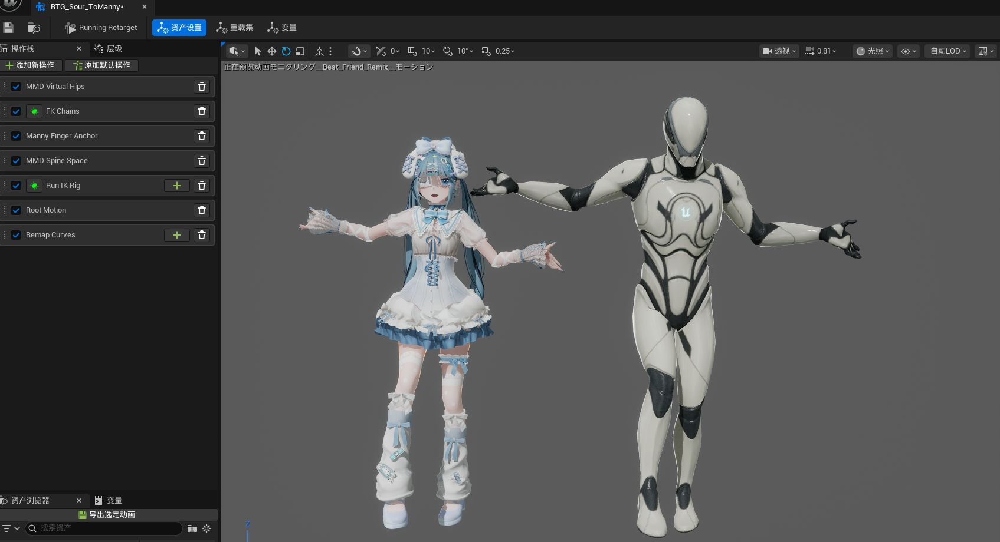
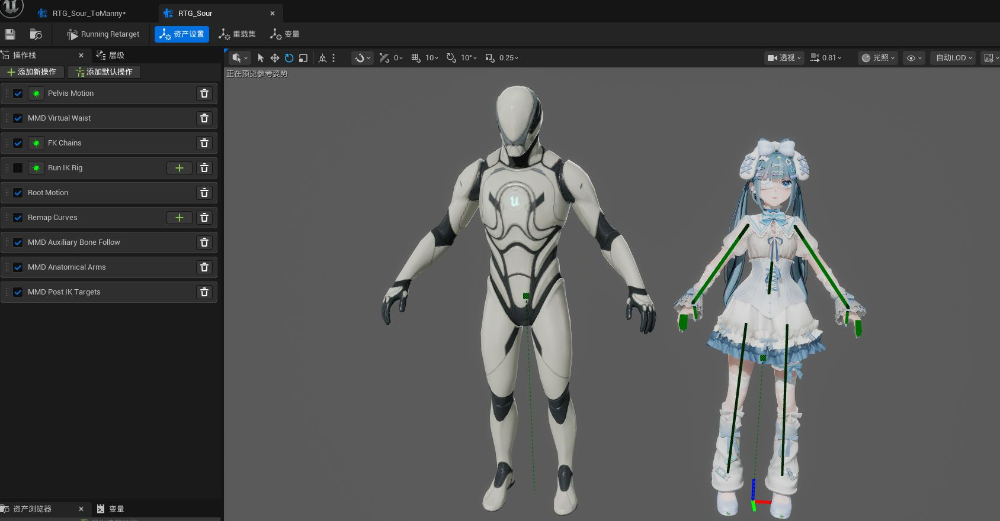

# 02 导入模型

这一章讲怎么把 MMD 的 `.pmx` 模型带进 Unreal。导入完成后你会得到一个可以直接拖进场景、能做表情、头发裙摆会自然飘动的角色。

## 开始之前：检查模型文件夹

`.pmx` 文件通常不是一个人在战斗，它的颜色、衣服图案都放在它旁边的贴图文件里。所以请确认：

- 模型和它配套的贴图仍然在原来的文件夹里，没有被打散。
- 如果你只拿到了一个孤零零的 `.pmx` 文件，先找素材发布者要完整的压缩包。

## 导入步骤

1. 在 Unreal 底部找到**内容浏览器**（显示资产缩略图的区域），建议先新建一个空文件夹专门放这个模型。
2. 把 `.pmx` 文件直接拖进内容浏览器。
3. 会弹出一个导入设置窗口。第一次使用不需要改任何东西，直接点右下角的**导入**按钮。
4. 等待进度提示跑完。模型越大等待越久，属正常现象。
5. 完成后，刚才的文件夹里就会出现一整套和模型相关的内容。

6. 请不要忘记及时保存，如果不手动点击保存的话，关闭UE编辑器以后就会消失！

## 导入窗口每个选项是什么意思

窗口里的选项按作用分成几组，逐个说明：

### 资产类型

- **角色**：人物模型。绝大多数情况选这个。
- **场景**：舞台、房间、家具这类自己不会动的模型。

### 贴图与外观

- **导入贴图**：把模型用到的颜色图案文件一起带进来。保持勾选，否则模型会是灰白一片。
- **创建材质**：以符合 UE 使用规范的方式为模型自动生成父子材质球。

### 表情

- **导入表情**：眨眼、微笑、张嘴这些面部变化都会被带进来，包括由多个小表情组合成的复合表情。
- 想要完整体验就保持勾选；如果暂时只要身体不要脸，关掉它能加快导入速度。

<small>**名称兼容提示**：你可能会看到部分表情名带有看起来奇怪的 `UE5EA_patch_` 前缀，它是现有的名称兼容前缀。`∧`、`▲`、`□` 这类特殊字符的表情名在 Control Rig 中会被转换成下划线，为避免冲突，导入时会为这类表情加上该前缀。带前缀的表情仍然对应原来的 PMX 表情，命名映射未改动。</small>

### 姿势辅助工具

- **创建IK资产**：为当前模型生成 `IKR_<模型名>`，并使用插件内置的精简 UE5 Manny 资源生成两个重定向器：`RTG_<模型名>` 把 Manny 动作转换到 MMD 模型，`RTG_<模型名>_ToManny` 把 MMD 动作转换到 Manny。两个 RTG 也会自动带上基础口型与眨眼映射，方便常见 MMD 表情与 ARKit 风格表情曲线一起转换。
- **创建Rig绑定**：生成 `CR_` / `CRMMD_` Control Rig，供你在 Sequencer 中手动调整姿势和制作动作。
- **手臂约束修正**：用于减少上臂、前臂和手掌穿进躯干、颈部、头部、腿部，或左右手臂互相穿透。角色导入时默认开启，场景导入时默认关闭；现在先保持默认即可，等动作导入以后再按 [05-2 手臂约束修正](05-2-手臂约束修正.md) 查看 Debug Draw 和详细调节方法。
- 如果暂时不了解这些资产，**保持默认开启就好**。它们是后续重定向和手动调动作时使用的辅助资产，不会妨碍普通导入。

### 物理

- **启用物理**：让头发、裙摆、饰品随着动作自然摆动。默认开启。
- **世界物理碰撞**：控制飘动的东西会不会被场景里的墙、地板挡开。比如角色靠墙站时头发会被墙面推开而不是穿过去。**角色模型默认开启，场景模型默认关闭。**
- 对裙摆这类由多条骨骼链组成的结构，插件会尽量使用 PMX 原有的链间 Joint 保持相邻裙片之间的整体关系；符合安全条件的规则环状裙摆也会自动补全缺失的横向连接。普通使用不需要手工建立这些连接，后续只需像其他 KawaiiPhysics 节点一样调整效果。

## 导入后得到了什么

打开导入时所在的文件夹，你会看到：

| 你看到的东西 | 它是什么 |
|---|---|
| 一个可以拖进场景的角色 | 模型本体，双击可以查看 |
| `Materials` 文件夹 | 模型的材质 |
| `Textures` 文件夹 | 模型的贴图 |
| `RM_<MeshName>` 文件 | 保存 PMX 模型注释信息的文本资产；双击可以查看注释 |
| 名字以 `IKR_` 开头的文件 | 当前 PMX 模型的 IK Rig，描述用于重定向的骨架链、IK 解算器和 Goal |
| `RTG_<模型名>` / `RTG_<模型名>_ToManny` | 分别用于 Manny → MMD 和 MMD → Manny 的动作转换，也会一起转换基础口型与眨眼曲线 |
| 名字以 `CR_` 或 `CRMMD_` 开头的文件 | 现代化手动调整姿势用的Rig控制器，摆姿势时会用到 |
| 名字以 `ABP_Post_` 开头的文件 | 让 MMD 的 IK、追加变形、手臂约束修正（包括身体与腿部避让）和物理效果实时运转的动画蓝图；导入时启用物理后可按第 03 章打开调优 |

材质和贴图分别收纳在 `Materials` 与 `Textures` 子文件夹里，方便查找。

包含 SDEF 的模型的 `ABP_Post_` 还会自动包含原生 SDEF 姿态修正节点，正常使用时不需要手动添加、删除或移动它。

`RM_<MeshName>` 是插件根据 PMX 模型注释生成的文本资产，不是额外的模型文件。它会保留 PMX 中的日文注释和英文注释（如果有），双击即可查看；重新导入模型时内容也会同步更新。

当前发布包已经自带生成双向重定向所需的精简 Manny 资源，因此正常情况下勾选 **创建IK资产** 后会直接得到 `IKR_<模型名>` 和两个方向的 RTG，不需要项目另外提供 Manny。如果插件内置资源缺失或损坏，导入提示会说明原因。反向转换请使用 `_ToManny` 资产，不要只交换正向资产中的预览模型。已有模型可在重新导入时仅勾选 IK 资产来重建两个方向的示例。

### 双向 RTG 示例

`RTG_<模型名>_ToManny` 用于 MMD → Manny，拥有独立的操作栈。

`RTG_<模型名>` 用于 Manny → MMD，并配置 MMD 所需的身体与 IK 处理。

### 两个 RTG 会一起转换哪些基础表情

目前两个方向都会自动处理最常用的五个 MMD 口型和普通眨眼：

| MMD 表情 | 对应的 ARKit 风格表情 |
|---|---|
| `あ` | 张嘴 `jawOpen` |
| `い` | 横向拉嘴 `mouthStretch` |
| `う` | 嘟嘴 `mouthPucker` |
| `え` | 嘴角收紧 `mouthDimple` |
| `お` | 圆口 `mouthFunnel` |
| `まばたき` | 眨眼 `eyeBlink` |

`RTG_<模型名>` 会把 Manny / ARKit 风格的这些表情带到 MMD 模型；`RTG_<模型名>_ToManny` 则会把 MMD 的这些表情带回 Manny / ARKit 风格曲线。需要左右两侧的表情（例如左右眼）会自动分配到两边。

这是一套**方便跨体系使用的粗略视觉映射**，目标是让基础口型和眨眼可以直接跟着动作一起工作，并不等同于精确的语音音素转换。不同角色的嘴型设计差异很大，如果某个口型看起来不理想，仍可以在目标角色上继续手动调整表情曲线。

如果模型是在加入这项功能以前导入的，可以重新导入 PMX，并只勾选 **IK Rig / IK Retargeter** 覆盖项来重建两个 RTG，不需要为了这项功能覆盖模型本体。

## 重新导入已经存在的 PMX

如果把同名 `.pmx` 再次拖到原来的 Unreal 文件夹，M2U 仍然会先弹出风险提示，而不是直接覆盖。

如果只是想保留旧版本，最安全的做法仍然是**改名后导入到新的文件夹**。如果已经确认需要用新的 PMX 更新现有模型，可以在提示窗口中选择 **重新导入PMX模型**。随后会出现第二个“PMX 重新导入选项”窗口，用来决定本次具体覆盖哪些内容。

其中 **覆盖骨骼网格体并同步 Skeleton** 是一个绑定的核心开关，不能只更新其中一个。它会覆盖 Skeletal Mesh，同时把兼容的骨架数据同步到现有 Skeleton；现有 Skeleton 资产本身和路径保持不变。新增骨骼或参考姿势变化可以在原 Skeleton 上同步，删除、重命名或改动已有骨骼父级等破坏性变化会在写入前被拒绝。这一项默认勾选，因此直接确认仍会正常更新模型本体、骨架、表情以及相关核心数据。材质与纹理可以单独选择是否覆盖。

PhysicsAsset、Post Process AnimBP、IK Rig / IK Retargeter 和 Control Rig 也可以分别选择是否覆盖。即使取消核心开关，这些附属项也不会被强制关闭：勾选的项目仍会基于当前实际使用的模型与 Skeleton 独立更新，未勾选的已有资产则不会由插件主动重建、改名、编译、保存或删除。这样可以只重建两个方向的 RTG、Control Rig 或其他附属资产，而不必覆盖模型本体。

如果旧模型包含 SDEF、但还没有迁移到当前的原生 SDEF 表示，第一次迁移时必须同时勾选 **覆盖骨骼网格体并同步 Skeleton** 与 **覆盖已有 Post Process AnimBP**。只勾选其中一个不能完成迁移；只覆盖核心项会被拒绝，插件也不会退回旧的 SDEF 变形路径。

需要注意：

- 重新导入属于覆盖操作，无法一键撤回，重要模型建议先备份。
- 对自动生成的 Rig、材质或其他相关资产做过的手工修改，如果本次勾选了对应覆盖项，就可能被重建或覆盖。
- 如果新 PMX 删除了旧模型中的某些材质、贴图或其他附属内容，旧资产目前不会自动帮你删除，可以确认无用后再手动清理。

## 常见问题

### 拖入模型没有任何反应

依次检查：

1. 插件和 KawaiiPhysics 是否都在 **编辑 > 插件** 里显示为已启用；安装后还需要重启编辑器。
2. 拖的是 `.pmx` 文件本身，而不是它的压缩包。
3. 换个内容浏览器文件夹位置再试一次。

如果第一项没有通过，请回看[下载与安装](01-下载与安装.md)。

### 导入成功但模型是灰白色的

模型的贴图没有跟着进来。最常见的原因是导入时贴图和 `.pmx` 文件不在同一套文件夹里。把完整的素材文件夹放回原样，删除灰白模型后重新导入，并确认导入窗口里的**导入贴图**处于勾选状态。

### 模型和 MMD 里的样子有细微差别

包含 SDEF 权重的模型会使用 UE 原生蒙皮，并自动生成姿态修正数据。QDEF 目前按四骨权重转换为 BDEF4 线性蒙皮，不能完整还原双四元数变形；扭转和弯曲时可能比 MMD 更容易收缩或压扁。SDEF 与 QDEF 混合模型可以正常导入。SDEF 姿态修正目前只为导入时的 LOD0 生成，之后手动创建的简化 LOD 没有对应数据，差异可能更明显。如果姿态修正数据无法完整生成，导入会提示失败。少数使用特殊骨骼或非常规约束的模型也仍可能和 MMD 原版出现差别。

### MMD 特有的光泽和描边没有完全还原

MMD 的 Sphere、Toon、Edge 等材质效果目前以基础材质为主，质感可能与 MMD 中不同，这是渲染引擎不同所致。

### 提示同名冲突

文件夹里已经有同名资产。M2U 不会直接覆盖，而是先显示风险提示：

- 想保留现有版本：放弃导入，改名或换一个新文件夹。
- 确认就是要更新现有模型：先确认已经备份需要保留的修改，然后点 **重新导入PMX模型**，再在第二个窗口里选择本次允许覆盖的资产。

## 下一步

模型进来了，先检查姿态和物理：[03 模型姿态与物理调优](03-模型姿态与物理调优.md)。
