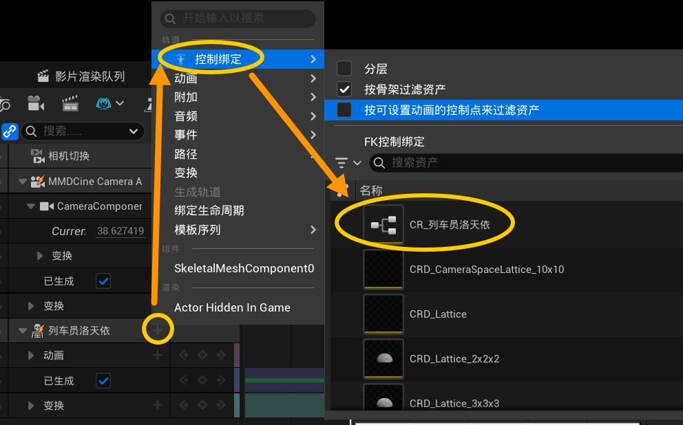

# 07 使用 Rig 创作动作

这一章介绍如何在 Unreal 的 Sequencer 里，从空白开始给 MMD 模型制作动作。推荐把本插件生成的 `CR_` 或 `CRMMD_` Control Rig 加到角色绑定上，然后直接在视口里摆姿势、打 K 帧。

如果你已经有一段 VMD 动作，只想在原动作上修正，请看下一章的[使用 Rig 编辑已有的动作](08-使用Rig编辑已有的动作.md)。

> **推荐路线**：想快速摆出全身姿势、用手腕带动手臂时，优先使用 `CR_模型名`；想像 MMD 一样直接旋转上臂、前臂和手腕时，可以使用 `CRMMD_模型名`。

## 开始之前

- 已按[导入模型](02-导入模型.md)导入 PMX 模型。
- 导入模型时已勾选**创建 Rig 绑定（Create Rig Binding）**。导入完成后，在模型文件夹或内容浏览器中能找到以 `CR_` 和 `CRMMD_` 开头的两个 Control Rig 资产。
- 如果找不到这两个资产，请重新导入一份模型，并保持**创建 Rig 绑定**开启。为了避免同名保护，建议使用新的空文件夹。
- 已准备一个关卡和一个可以放入关卡的 MMD 角色。

## 一、创建 Level Sequence 并加入角色

1. 在内容浏览器中点击**添加（Add）**，在过场动画（Cinematics）分类下创建 **Level Sequence**，取一个容易认出的名字，例如 `Dance_Rig`。
2. 双击打开这个 Level Sequence，使它出现在 Sequencer 中。
3. 把内容浏览器里的 MMD 角色拖进关卡，再把关卡中的角色从 **World Outliner** 拖到 Sequencer。也可以选中角色后使用 Sequencer 的 **Actor to Sequencer**，两种方式结果相同。
4. 在 Sequencer 顶部设置播放范围。若动作要按 MMD 的帧号制作，建议把序列显示帧率设为 **30 FPS**；这样时间轴上的 30 帧就是 MMD 的 1 秒。之后导出 VMD 时，插件也会按 MMD 的 30 FPS 时间基准处理。

## 二、把 Control Rig 加到角色上

1. 选中角色下的 **Skeletal Mesh** 轨道，点击右侧的 **+ Track**。
2. 选择 **Control Rig > Control Rig Classes**。
3. 从列表中选择本模型对应的 `CR_模型名` 或 `CRMMD_模型名`。不要选其他模型的 Rig；骨骼不对应时，Rig 可能不会出现在列表中，或者控制器不会正确驱动角色。

4. Sequencer 中会出现 Control Rig 轨道和一个 Control Rig 片段。展开它，可以看到可动画的控制器；在列表中选中控制器时，视口里也会选中对应的控制器，反过来在视口点击控制器也会定位到 Sequencer 中的控制器。
5. 如果视口看不到控制器，先展开 Control Rig 轨道并选中一个控制器，再把视口焦点移到角色；同时确认没有点击该轨道左侧的眼睛图标将 Rig 隐藏。
关于如何在sequencer中K帧，可以参考更多的UE视频教程或者官方手册，每个人可能都会有自己的习惯，文档后文也有讲解但不会过多展开。

> **首次使用提示**：Control Rig 现在在重新进入后会自动完成编译。首次加入 Rig 后如果控制器暂时没有效果，可以任选一种方式触发一次：双击打开对应的 `CR_` / `CRMMD_` 资产一次，或在关卡视窗点击一次 **运行** 按钮。运行结束后，Control Rig 会保持已完成编译的状态，无需重复操作。

### `CR_` 和 `CRMMD_` 怎么选

| Rig 资产 | 适合的创作方式 | 常用控制器 | 建议 |
|---|---|---|---|
| `CR_模型名` | 通过 IK 快速摆出自然姿势 | `CTRL_HandIK_L/R`、`CTRL_ElbowPole_L/R`、`CTRL_LegIK_L/R`、`CTRL_Toe_L/R` | 更加直觉和自然的控制策略，适合大部分动作和新手上手 |
| `CRMMD_模型名` | 按 MMD 骨骼的 FK 习惯逐段旋转 | `CTRL_UpperArm_L/R`、`CTRL_LowerArm_L/R`、`CTRL_Hand_L/R` | 需要大幅度甩手臂，或习惯 MMD 操作时使用，舞蹈类一般推荐这个 |

两套 Rig 都包含身体、头部、眼睛、手指、腿脚和面部控制器。左右两侧控制器通常以 `_L` 和 `_R` 结尾；`L` 表示左侧，`R` 表示右侧。

这套模型控制器的自动绑定算法是`RedialC`倾注了大量心血的产物，如果你使用了这套rig产出了动作数据并觉得好用,希望能够标注使用工具让更多人使用上现代化的MMD动作K帧流程！

## 三、在时间轴上自由打 K 帧

### 1. 先制作起始姿势

1. 把播放头移动到动作开始帧，通常是第 0 帧。
2. 在视口中选择要控制的控制器，使用移动、旋转工具摆姿势；也可以在 Sequencer 或 Details 面板中直接输入数值。
3. 一次选中需要同时记录的多个控制器，例如躯干、左右手和双脚。
4. 对身体这类变换控制器按 `S`，或点击 Sequencer 中的钥匙按钮，给选中的控制器添加关键帧。首次打帧后，控制器下方会出现对应的通道和钥匙。

### 2. 在后续帧改变姿势

1. 把播放头拖到下一个动作节点，例如第 15、30 或 45 帧。
2. 移动或旋转控制器改变姿势，然后再次按 `S` 或点击钥匙按钮。
3. 继续移动播放头、修改控制器并打帧。Sequencer 会在相邻关键帧之间自动插值；关键帧越少，动作越平滑，关键帧越多，动作越容易精确卡在指定姿势上。
4. 想让某个姿势保持一段时间时，在保持开始和结束的位置都给相关控制器打帧，不要只在开始位置打一个帧。
5. 想一起修改一组控制器时，先在视口或 Sequencer 中多选它们，再一次打帧。这样可以避免躯干、手脚只记录到一部分而产生不一致的姿势。

### 3. 手臂和腿的实际操作

- 使用 `CR_` 时，先移动 `CTRL_HandIK_L/R` 摆放手的位置，再移动 `CTRL_ElbowPole_L/R` 调整手肘朝向，最后旋转手部控制器。手肘突然翻向另一侧时，通常是 Pole 控制器的位置不合适。
- 使用 `CRMMD_` 时，按 **上臂 → 前臂 → 手** 的顺序旋转 `CTRL_UpperArm_*`、`CTRL_LowerArm_*`、`CTRL_Hand_*`。这种方式更接近直接旋转 MMD 的上腕、下腕和手腕骨骼。
- 腿部可以用 `CTRL_LegIK_L/R` 移动脚的位置，用 `CTRL_LegAngle_L/R` 调整腿部朝向，再用 `CTRL_Toe_L/R` 调整脚趾。脚底需要贴地时，先处理脚部 IK，再处理脚趾。
- `CTRL_Root`、`CTRL_Center`、`CTRL_Groove` 和 `CTRL_Pelvis` 负责整体位置、身体重心和骨盆。只想改变身体姿势时，优先旋转躯干控制器；要让角色整段移动，再移动 Root 或 Center。

## 四、手指、眼睛和表情

- 展开手部控制器后，可以看到类似 `CTRL_Thumb_1_L`、`CTRL_Index_1_R` 的手指控制器。手指控制器从根部到指尖逐段编号；同时选中同一只手的多个手指控制器后再打帧，会更容易保持手型。
- `CTRL_Eye_L` 和 `CTRL_Eye_R` 用来控制视线方向。先在某一帧摆好视线，再到后续帧改变方向并打帧，就能制作看向不同位置的动作。
- 面部控制器以 `CTRL_Face_` 开头，并按眼睛、嘴、眉毛等区域分组显示。选择面部滑块后，在 Sequencer 中点击该通道旁的钥匙按钮记录表情值；表情通常用 0 到 1 的滑块控制。要让表情保持一段时间，在开始和结束帧都记录相同值。
- **从 MMD2Unreal 2.1.05 起，只有 PMX 的 Vertex Morph（顶点 Morph）会生成 Control Rig 表情滑块。Bone、Group、UV、Material、Flip、Impulse Morph 不会出现在 `CTRL_Face_` 面板中。**
- 不同 PMX 模型的表情数量和日语名称可能不同。找不到某个表情时，先展开对应的面部组，不要直接修改 Rig 资产。

## 五、调整关键帧和曲线

1. 展开 Control Rig 轨道，找到某个控制器下面的平移、旋转或表情通道。
2. 在时间轴上拖动钥匙改变发生时间；在 Curve Editor 中可以调整曲线的插值方式和切线，让起停更自然。
3. 发现动作在某个关键帧前后抖动时，先检查相邻帧的旋转是否跳得太大，再决定移动关键帧或修改曲线。不要为了修一个姿势而删除整条 Control Rig 轨道。
4. 控制器的关键帧保存在 Level Sequence 中；`CR_` / `CRMMD_` 资产只是定义控制器和求解方式。保存序列即可保留动作，不需要另存或修改 Rig 资产。

## 六、预览和保存

1. 在 Sequencer 中拖动播放头检查关键姿势，再点击播放按钮观看完整动作。
2. 重点检查手脚是否翻转、脚底是否穿地、手指是否跟随手腕、眼睛和表情是否在正确的帧发生。
3. 头发、裙摆等动态物理效果会在场景播放时实时计算，不要为了给物理效果打帧而修改控制器。
4. 保存 Level Sequence。需要把最终动作带回 MMD 时，继续看[09 导出角色动作 VMD](09-导出角色动作.md)；导出时会读取 Sequencer 中角色最终显示出来的动作和表情。

## 常见问题

### 选不到 `CR_` 或 `CRMMD_`

确认角色使用的是本插件导入的 Skeletal Mesh，并且导入模型时开启了**创建 Rig 绑定**。还要确认 Control Rig 资产已经完成加载；如果刚导入模型，等内容浏览器刷新后再重新打开 Level Sequence。

### 加入 Rig 后角色回到奇怪的姿势

通常是选错了模型的 Rig，或者把 Rig 加到了错误的角色绑定下。删除这个 Control Rig 片段，在同一个角色的 Skeletal Mesh 轨道下重新添加与模型同名的 `CR_` / `CRMMD_`。

### 打了帧但播放时没有变化

确认你修改的是已加入 Sequencer 的 Control Rig 控制器，而不是内容浏览器里双击打开的 Rig 资产；确认控制器没有被隐藏，并且播放头位于 Control Rig 片段的范围内。

### 动作如何继续用于导出

不需要把控制器手动转换成骨骼动画。保存 Level Sequence 后，在[导出角色动作 VMD](09-导出角色动作.md)中选择当前 Sequencer 作为来源即可。

## 下一步

如果你手上已经有一段动作，想在不破坏原动作的前提下追加修改，请看[08 使用 Rig 编辑已有的动作](08-使用Rig编辑已有的动作.md)。创作或修改完成后，再看[09 导出角色动作 VMD](09-导出角色动作.md)。
