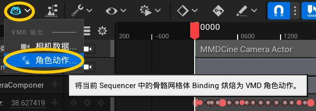
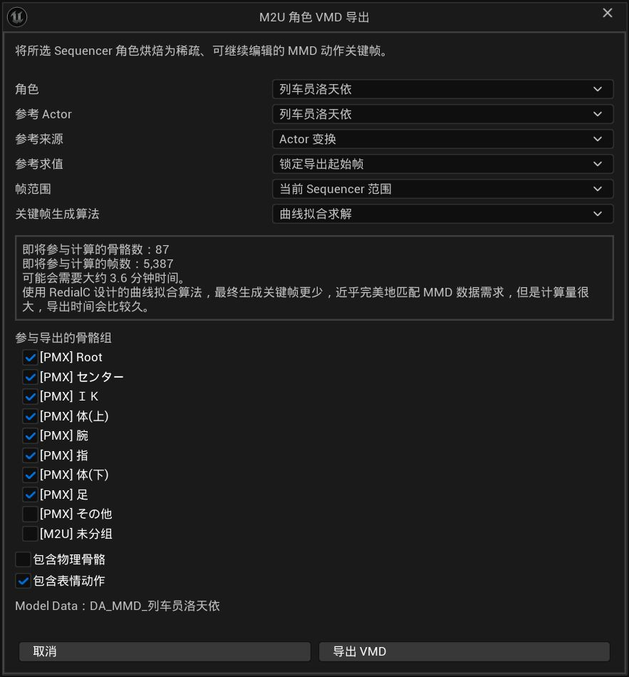
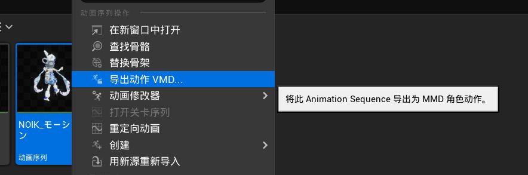
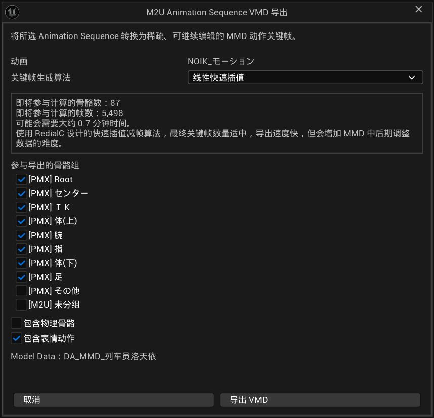

# 09 导出角色动作 VMD

前面几章是把 MMD 内容带进 Unreal，这一章反过来：把你在 Unreal 里调好的角色动作保存成 MMD 可以直接读取的角色动作 `.vmd` 文件。身体动作和面部表情都可以一起带回去。

## 开始之前

- 你已经通过本插件导入了对应的 `.pmx` 模型。
- 如果要导出 Sequencer 里的表演，需要把角色放进 Level Sequence，并在 Sequencer 里打开这段序列。
- 如果要导出单独的动画序列，需要先把对应的 MMD 骨骼网格体设置为它的 **Preview Mesh**。模型必须和这条动画来自同一个 MMD 模型。

## 两种导出方法

### 从 Sequencer 导出角色动作

1. 在内容浏览器里**双击**要导出的 Level Sequence，在 Sequencer 中打开它。
2. 确认时间轴里有要导出的角色。
3. 点击 Sequencer 顶部工具栏的 **M2U** 按钮，在菜单里选择 **角色动作...**。
4. 在弹出的窗口里按后文的说明设置。

5. 点击**导出 VMD**，选择保存位置和文件名。默认文件名是角色的名字加上 `.vmd`。
6. 等待进度条完成。导出结束后会弹出结果报告。

### 关于 IK、Post Process 和 VMD 兼容

角色 VMD 导出会保留 **MMD 作者数据**，而不是把 UE 中已经经过 `ABP_Post_` 的最终腿部姿势再次烘焙进 VMD。

- 从 Sequencer 导出时，插件会在采样角色骨骼的过程中临时关闭 Post Process AnimBP。
- 从 Animation Sequence 导出时，插件直接读取动画序列中的骨骼轨道。
- 因此足 IK / 足先 IK 控制骨会按动画中的控制轨道导出，PMX CCD、追加变形和物理会在回到 MMD 后由模型重新计算。
- 这样可以避免“已经在 UE 解过一次 IK，又在 MMD 解第二次”的双重 IK。
### 从 Animation Sequence 导出角色动作

1. 在内容浏览器里选中**一条** Animation Sequence。
2. 右键它，选择 **导出动作 VMD...**。
3. 在弹出的窗口里确认预览模型和这条动画对应的 MMD 模型一致，然后按后文的说明设置。

4. 点击**导出 VMD**，选择保存位置和文件名。默认文件名是动画序列的名字加上 `.vmd`。
5. 等待采样进度完成，查看结果报告。

如果右键菜单里没有 **导出动作 VMD...**，请确认你选中的是一条 Animation Sequence，而不是文件夹、模型或多条动画；同时要先设置好对应的 **Preview Mesh**。

## 导出窗口每个选项是什么意思

### 角色 / 动画

- 从 Sequencer 导出时，**角色**下拉框会列出这段序列里的骨骼网格体。选择真正要导出的那个角色。
- 从 Animation Sequence 导出时，窗口只显示当前选中的动画序列，不需要再次选择角色。

### 参考 Actor（只在从 Sequencer 导出时出现）

角色可能已经被你摆到了场景中的某个位置。参考设置用来告诉插件：导出时，应该以哪个对象作为角色的整体位置参考。通常选择和“角色”相同的 Actor 就可以。

#### 参考来源

- **Actor 变换**：以整个 Actor 的位置和朝向为参考。最简单，第一次使用推荐选它。
- **组件变换**：以 Actor 上指定组件的位置和朝向为参考。
- **骨骼 / Socket 变换**：以角色身上的指定骨骼或 Socket 为参考。下方名称框默认是 `全ての親`，也就是模型的总根骨骼。

#### 参考求值

- **锁定导出起始帧**：把导出开始时的参考位置作为基准，适合角色只是被摆放到场景中、之后再开始表演的情况。角色在后续时间轴中的整体移动仍可以被记录。
- **逐帧跟随**：每一帧都重新以参考对象为基准，适合角色 Actor 本身会在场景中移动、而你只想导出相对动作的情况。

不确定时，选择同一个角色、**Actor 变换**和**锁定导出起始帧**即可。

### 帧范围（只在从 Sequencer 导出时出现）

- **当前 Sequencer 范围**：导出时间轴的播放范围。
- **自定义范围**：输入起始帧和结束帧，只导出其中一段。自定义帧必须在当前播放范围内。

从 Animation Sequence 导出时，插件会使用整条动画的播放长度，不需要另外设置帧范围。

### 关键帧生成算法

这个选项决定 VMD 文件里保留多少关键帧，以及导出需要多久：

- **曲线拟合求解**：尽量用较少的关键帧还原动作，适合希望回到 MMD 后继续使用、并且重视还原度的情况。计算时间较长。从 Sequencer 导出时默认使用它。
- **线性快速插值**：导出速度快，关键帧数量适中。适合先快速检查结果；回到 MMD 后继续细调时，可能不如曲线拟合自然。从 Animation Sequence 导出时默认使用它。
- **完全逐帧烘焙**：每一帧都写入数据，文件会明显变大，甚至可能因为数据量太多而无法被 MMD 载入，一般不推荐。

#### 高级曲线拟合（仅“曲线拟合求解”）

选择**曲线拟合求解**后，可以展开默认收起的**高级曲线拟合**。这四个参数决定插件在“少写关键帧”和“尽量还原原动作”之间怎样取舍；保持默认值通常就是最稳妥的选择。切换到**线性快速插值**或**完全逐帧烘焙**时，该区域不会显示，也不会参与导出。

| 参数 | 默认值（可调范围） | 作用与调整建议 |
|---|---:|---|
| **位置容差（cm）** | 0.10（0.01–10） | 相邻保留关键帧之间，允许的位置拟合误差。调小会更忠实地保留位移细节，但关键帧、文件体积和导出时间都会增加；调大则更容易减帧。单位是 Unreal 的厘米，插件会按当前模型的导入比例处理。 |
| **旋转容差（度）** | 0.20（0.01–10） | 允许的骨骼旋转拟合误差。手指、头部等对细微转动敏感时可适当调小；只想压缩普通身体动作时可谨慎调大。 |
| **表情拟合容差** | 0.01（0.0001–0.25） | 允许的表情权重插值误差。较小会保留更多口型、眨眼和表情变化，较大则会合并更接近的表情关键帧。 |
| **表情零值阈值** | 0.005（0–0.10） | 会把绝对值不超过该阈值的表情权重当作 0，用来清理极小的浮点噪声。调大可减少无意义的表情数据，但过大可能吃掉很弱的表情。 |

建议先用默认值导出并在 MMD 中检查；如果动作细节被简化，优先只降低对应的容差。如果文件过大或导出太慢，再逐步增大位置、旋转或表情拟合容差。不要为了压缩文件同时大幅提高所有参数，以免问题难以判断。

### 参与导出的骨骼组

窗口会列出模型 PMX 文件里的骨骼分组，以及你自己创建的分组。勾选想要写入 VMD 的分组即可，至少要保留一个分组。未分组的骨骼默认不会参加导出。

默认设置会避开名字看起来像头发、裙子或物理骨骼的分组，因为这些内容通常交给物理系统实时计算。

- **包含物理骨骼**：默认关闭。关闭时，动态 PMX 物理骨骼即使属于已勾选分组，也不会写入 VMD。当前版本即使打开，也只是允许这些骨骼已有的动画轨道进入导出集合，**不会烘焙 KawaiiPhysics / Post Process 的实时物理结果**。
- **包含表情动作**：默认开启。会把眨眼、口型等已经存在于模型中的表情一起写进 VMD。关闭后只导出骨骼动作。
- **始终导出整体位移骨骼**：默认开启。MMD 里角色的整体位移由 `全ての親` / `センター` / `グルーブ` / `腰` 这些骨骼承载。开启时，即使没有勾选它们所在的分组，也会把这些骨骼写进 VMD，避免角色整体位移丢失。关闭后如果这些骨骼仍带有位移，报告会给出提示。

窗口底部的 **Model Data** 状态必须可用。它来自导入模型时生成的信息，用来确保骨骼和表情能以正确的 MMD 名称导出。

### 工作量预估

窗口会显示预计参与计算的骨骼数量、帧数量和大致耗时。这个时间只是估算，模型复杂度和电脑速度都会影响实际耗时；选择曲线拟合或逐帧烘焙时，耗时通常会更长。

所有角色动作导出都使用 MMD 常用的 30 FPS 时间基准，不需要另外选择导出帧率。

## 导出结果怎么看

成功后会弹出结果报告，文件已经保存到你选择的位置。报告里的数字含义如下：

| 数字 | 含义 |
|---|---|
| 稠密采样数 | 插件实际检查过的动作帧数 |
| 候选骨骼 | 你勾选的骨骼组中找到的骨骼数量 |
| 排除物理骨 | 因默认设置而没有写入的动态物理骨骼数量 |
| 导出骨骼轨道 | 最终写入 VMD 的骨骼数量 |
| 骨骼关键帧 | 输出文件中的骨骼动作关键帧数量 |
| 表情关键帧 | 输出文件中的表情关键帧数量 |

报告出现警告时，文件仍可能已经成功写出。常见情况是某根骨骼在模型中找不到、某个表情名称不符合 VMD 的命名限制，或动作使用了 VMD 不支持的骨骼缩放；这些部分会被跳过，详情可以在 Output Log 中查看。

## 常见问题

### 导出角色动作时找不到 M2U 菜单

- 从 Sequencer 导出前，要先在 Sequencer 中打开一个 Level Sequence，并确认序列里有骨骼网格体角色。
- 如果要导出单独的动画，请在内容浏览器中只选中一条 Animation Sequence，然后右键查看**导出动作 VMD...**。

### 导出角色动作提示 Model Data 不可用，或 Preview Mesh 不匹配

角色动作导出需要模型导入时生成的 Model Data。请确认 Animation Sequence 的 **Preview Mesh** 是同一个 MMD 模型的骨骼网格体；如果 Model Data 丢失或不可用，恢复原来的 `.pmx` 文件后重新导入模型，再重新导出。

### 导出后没有表情

打开角色动作导出窗口里的**包含表情动作**。如果报告里的表情关键帧仍然是 0，检查模型是否在导入时启用了**导入表情**，以及原动作或动画里是否真的有表情曲线。

### 导出后头发、裙子没有动作

角色动作导出默认不包含动态物理骨骼。回到 MMD 后，头发和裙摆通常由 MMD 的物理系统重新计算；这不是普通骨骼动作丢失。如果这些物理骨本身已经有动画轨道，可以勾选**包含物理骨骼**把这些轨道写进 VMD；当前版本不会把实时 KawaiiPhysics 结果自动烘焙进去。

### 角色动作导出很慢，或者 VMD 文件太大

在**关键帧生成算法**中优先选择**曲线拟合求解**来获得较少的关键帧；想快速检查结果时可以选择**线性快速插值**。不要轻易使用**完全逐帧烘焙**，它会把每一帧都写入文件，可能导致 MMD 载入失败。

### 在 MMD 里改成线性后正常，但曲线补间会抖动

当前版本会按 MMD 的标准格式写入骨骼 Bézier 插值数据。如果这个 VMD 是由较早版本导出的，可能出现“手动改成线性补间后正常，但保留非线性曲线时动作会抖动”的现象。请使用当前版本重新导出 VMD；不需要为了绕过这个问题长期改用线性补间，也不需要改成完全逐帧烘焙。

### 升级插件后，旧 VMD 里的脚仍然滑动或脚踝扭转

如果 VMD 来自升级前已经导出 / 烘焙好的 Retarget Animation，那么 Animation Sequence 里仍然保存的是旧的足 IK / 足先 IK 控制轨道，插件升级不会自动改写它。请先从当前 `RTG_<模型名>` 重新导出 / 烘焙 Animation Sequence，再用新动画导出 VMD。

仅为了这一轮足部目标修正，现有 RTG 通常不需要重建；如果还要使用 **Leg Prebend → Enable Knee Prebend**，而旧 RTG 看不到该设置或提示缺少膝盖信息，再重新导入 PMX 并覆盖 **IK Rig / IK Retargeter**。

### 导出报告里的骨骼数量比预期少

检查导出窗口中的骨骼分组是否都已勾选。未分组骨骼默认不参加导出，动态物理骨骼在**包含物理骨骼**关闭时也会被排除。报告里的“排除物理骨”数量可以帮助判断是不是这个原因。

### 回到 MMD 后角色整体位移不对，四肢动作却正常

先看导出报告里的提示。MMD 的整体位移由 `全ての親` / `センター` 等骨骼承载：如果这些骨骼没有写进 VMD，角色会停在原地或只在原地摆动，而四肢动作看起来仍然正确。保持**始终导出整体位移骨骼**开启，或确认包含这些骨骼的分组已经勾选。

如果报告提示足 IK / 足先 IK 控制骨在整段动画中保持静态，说明这份动画里的足部目标没有生成（常见于重建 RTG 之后没有重新导出角色动画）。请在 Unreal 里重建 RTG、重新导出角色动画之后，再导出 VMD。

### 角色动作 VMD 能导出哪些内容

会导出角色骨骼动作和模型中已有的表情；镜头请看[10 导出镜头](10-导出镜头.md)。材质、场景等其他类型的 MMD 内容目前不能导出回 MMD。

## 带回 MMD 后的注意事项

- 在 MMD 中打开 VMD 时，选择和导出时相同的模型，日语骨骼名和表情名才能正确对应。
- 动态物理骨骼默认不写入文件，因此头发、裙摆等效果通常由 MMD 播放时的物理系统重新计算；这不会影响普通骨骼动作。
- 这项功能只导出角色动作和表情，不包含镜头。镜头请看[10 导出镜头](10-导出镜头.md)。

## 下一步

角色动作导出完成后，可以继续看[10 导出镜头](10-导出镜头.md)，把 Unreal 中的镜头带回 MMD。
