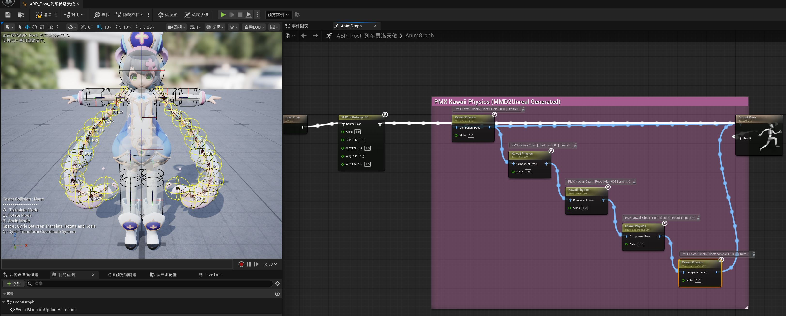
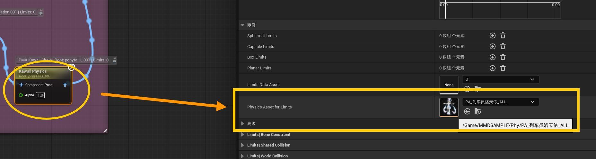

# 03 Model Pose and Physics Tuning

This chapter covers two checks after importing a model: verify its initial pose, then tune the physics of hair, skirts, sleeves, and accessories.

## When this chapter applies

The KawaiiPhysics nodes and collision assets described here are created only when **Enable Physics** is checked in [Importing a Model](02-import-model.md). After import, you can usually find these assets in the Content Browser:

| Asset | Purpose |
| --- | --- |
| `ABP_Post_<ModelName>` | Post-process Animation Blueprint that keeps MMD IK, additional transforms, Arm Constraint Correction (including body and leg avoidance), and KawaiiPhysics working during playback. |
| `Phy/PA_<ModelName>_ALL` | Physics Asset containing all usable MMD colliders. This is the default asset used by KawaiiPhysics. |
| `Phy/PA_<ModelName>_G00`, `_G01`, … | Physics Assets split by MMD collision group, for inspection or selecting one group manually. The generated numbers depend on the PMX model. |
| `IKR_<ModelName>` | IK Rig for the current PMX model, including PMX retarget chains, the Full Body IK solver, hand/foot/toe Goals, and the PMX shared body-root and Root Motion Bone settings. |
| `RTG_<ModelName>` | Converts UE5 Manny motion to the current MMD model. |
| `RTG_<ModelName>_ToManny` | Converts motion from the current MMD model to UE5 Manny. |

If the physics assets are missing, check that **Enable Physics** was enabled, that the KawaiiPhysics plugin is enabled, and that the PMX contains valid rigid bodies and dynamic bone chains. If the model was imported without physics, import the PMX again with **Enable Physics** enabled. Use a new content folder if the project already contains same-named assets.

## What the ABP does

`ABP_Post_<ModelName>` is the model's post-process Animation Blueprint. It does not replace the base VMD or Sequencer animation. Instead, it keeps the MMD model's own IK, additional transforms, Arm Constraint Correction (including body and leg avoidance), and physics working after the base animation has been evaluated.

**Arm Constraint Correction** reduces upper-arm, forearm, and hand penetration into the torso, neck, head, legs, or the opposite arm. At this stage you only need to know what it is for; leave the generated defaults alone. After importing character motion, [05-2 Arm Constraint Correction](05-2-arm-constraint-correction.md) explains Debug Draw, probe ranges, and detailed tuning.

VMD, Control Rig, and other Sequencer animation remain the main source of the pose. During preview or playback, dynamic bones such as hair and skirts are recalculated from the current pose and the model's movement.

When **Enable Physics** is disabled, the importer may still create `ABP_Post` for MMD IK, additional transforms, and Arm Constraint Correction, but it does not create the KawaiiPhysics nodes or the per-group physics assets used in this chapter. Those assets cannot be tuned through this workflow in that case.

## What the IK nodes do

The MMD IK/constraint nodes in the ABP follow the settings stored in the PMX model so feet, knees, arms, and similar parts keep the relationships intended by the model author. They also handle MMD additional rotation and translation.

With the automated setup, in most cases you do not need to adjust every IK channel separately as you would in MMD. The matching IK values shown on the generated node are still the switches for the corresponding MMD IK channels.

In almost all cases, leave the generated IK nodes unchanged. Different models can use different bones and constraints, and manual changes can cause backward knees, drifting feet, flipped arms, or motion that no longer matches MMD. Hair, skirt, sleeve, and other dynamic-bone collision problems should normally be solved with the Physics Asset and KawaiiPhysics settings; if the **arm or hand enters the character's own body, head, legs, or opposite arm**, use [05-2 Arm Constraint Correction](05-2-arm-constraint-correction.md) instead.

## The relationship between IKR and RTG

`IKR_<ModelName>` (IK Rig) is the “skeleton rule set” for the current PMX model. It contains retarget chains, IK solvers, and Goals such as the hand, foot, and toe Goals. The importer builds these from the PMX bone semantics, side, and role. In normal use you do not need to edit the IKR, and retargeting does not rewrite the model's Skeleton.

`RTG_<ModelName>` and `RTG_<ModelName>_ToManny` (IK Retargeters) are the motion converters. They are fixed to **UE5 Manny → MMD** and **MMD → UE5 Manny** respectively. Each asset has its own Source, Target, preview mesh, chain mapping, and operation stack. Do not swap Source, Target, or the preview mesh inside one RTG to reverse its direction; use the `_ToManny` asset for the reverse direction.

The current release package already includes the minimal UE5 Manny content required for bidirectional retargeting. With **Create IK Asset** enabled, a normal import therefore creates the PMX IKR and both RTG directions without requiring Manny assets from the project. The RTGs may fail to generate only when the bundled plugin content is missing or damaged, in which case import or reimport shows a warning.

`IKR_`, `RTG_`, and `ABP_Post_` have different responsibilities: the IKR describes retargeting rules, the RTG converts motion to another skeleton, and `ABP_Post_` continues to evaluate PMX Grants, CCD IK, IK link limits, Arm Constraint Correction, and physics during playback. A retargeted motion still passes through the post-process Animation Blueprint to produce the complete MMD pose.

## RTG operation stacks

The entries in an RTG's **Operation Stack** are evaluated in order. The importer configures them automatically when it creates or rebuilds an RTG, so normal use does not require adding, deleting, or dragging entries. The forward and reverse lists are intentionally different; do not copy one list directly to the other.

### Forward: `RTG_<ModelName>` (Manny → MMD)

This is the main case shown in the screenshot. For a model with the required PMX structure, the logical order is:

| Operation | Purpose | Default and recommendation |
| --- | --- | --- |
| **Pelvis Motion** | Sends Manny's whole-body pelvis motion to the PMX shared body root that connects the spine and both legs, instead of treating the leg-only `下半身` as the pelvis. | Leave enabled. |
| **MMD Virtual Waist** | Provides a temporary waist parent between the upper- and lower-body branches during RTG evaluation, so both branches use the correct space before FK. It does not add a bone to the Skeleton. `Pivot Offset` defaults to zero and normally needs no adjustment. | Leave enabled and before FK Chains. |
| **FK Chains** | Transfers bone rotations through the IKR chain mapping. All chain Translation modes default to `None` to preserve PMX bone lengths; Clavicle uses `OneToOne`, while Arm chooses `OneToOne` or `Interpolated` from the real hierarchy. | Keep the defaults. |
| **Run IK Rig** | Selects and runs the current PMX Target IKR. The forward RTG disables the entire operation because `ABP_Post_` performs PMX CCD IK afterwards; disabling only the leg checkboxes does not stop the UE IK solver from running. | **Keep disabled**. Do not re-enable it. |
| **Root Motion** | Generates whole-body motion from the already processed target pelvis and writes it to the PMX Root Motion Bone (normally `全ての親`), without propagating it to non-retargeted helper children. | Leave enabled with its defaults. |
| **Remap Curves** | Transfers animation curves according to the Source/Target mapping. | Keep the default. |
| **MMD Auxiliary Bone Follow** | After FK, lets PMX helper bones that are outside the standard retarget chains follow the current parent's local pose. It does not reset body bones already driven by retargeting. | Leave enabled when present. |
| **MMD Anatomical Arms** | Uses Manny's chest, upper arms, forearms, and hands to rebuild both PMX arms through their real three-part hierarchy. It preserves hand spacing, wrist placement, and finger branches when model proportions or twist/helper bones differ. `Hand Contact Alpha` defaults to `1.0` and controls the correction strength when the hands approach each other. | Leave enabled and before `MMD Authoring IK Targets`. |
| **MMD Authoring IK Targets** | Uses the current Source IKR and `FK Chains` leg/toe mappings to create PMX foot/toe IK-controller tracks. It does not depend on specific source bone names and does not derive IK from the already-retargeted PMX deform feet. `ABP_Post_` remains responsible for the real PMX CCD solve. | Appears only when valid PMX foot IK exists; **keep it last**. |

### Knee prebend near full extension

**Leg Prebend → Enable Knee Prebend** in `MMD Authoring IK Targets` is off by default. Leave it off for normal motion. If a retargeted leg occasionally flips its knee or changes bend direction when it is almost perfectly straight, try enabling it. It only gives the knee a bend-direction hint; it does not replace the foot IK target with a different motion.

If the RTG was generated by an older version and the option is missing, or enabling it reports missing knee / foot information, reimport the PMX and overwrite only **IK Rig / IK Retargeter** so the plugin rebuilds `IKR_` and both `RTG_` assets. You do not need to overwrite the Skeletal Mesh for this feature.

### Old retargeted animations still show foot sliding or ankle twisting after an update

The current version improves the forward RTG foot IK and toe IK targets. Animation Sequences that were already exported or baked with an older version are not recalculated automatically when the plugin is updated. If an old animation still has planted-foot sliding or unexpected ankle twisting, export / bake the Animation Sequence again from the current `RTG_<ModelName>` before using it or exporting VMD.

For these foot-target fixes alone, an existing RTG normally does not need to be rebuilt. Rebuild the IK assets only when you also want the knee-prebend option and the older RTG does not contain the required settings.

### Reverse: `RTG_<ModelName>_ToManny` (MMD → Manny)

The reverse asset is rebuilt from the default list with this logical order:

| Operation | Purpose | Default and recommendation |
| --- | --- | --- |
| **MMD Virtual Hips** | Replaces native `Pelvis Motion`. It combines PMX Root / Center / Groove translation with `下半身` rotation to synthesize the common `pelvis` needed by Manny, so the spine and legs share the correct parent space. It does not create or modify real bones. `Translation Offset` defaults to zero and normally needs no adjustment. | Leave enabled and before FK Chains. |
| **FK Chains** | Maps PMX rotations to Manny and sets every chain's Translation mode to `None`, preserving Manny's own bone lengths. Manny's extra metacarpal chains remain structural bones and do not receive PMX finger rotation a second time. | Keep the defaults. |
| **Manny Finger Anchor** | After FK, rebuilds unmapped structural links between the palm and fingers and recomposes finger translations. Equal-length finger chains apply each local rotation only once, avoiding over-curled fingers. `Max Joint Rotation Degrees` defaults to `120°` and normally does not need changing. | Leave enabled and before `MMD Spine Space`. |
| **MMD Spine Space** | After reverse FK, reconciles the upper-body space used by Manny's spine with the independent PMX upper-body branch. It adjusts only the spine branch, not the leg branch. | Leave enabled and before Run IK Rig. |
| **Run IK Rig** | Selects and runs Manny's Target IKR. Reverse conversion needs it for the target skeleton's IK; to avoid fighting the reverse FK, the generated settings disable the left/right arm IK chains while leaving leg IK available. | **Keep enabled**. |
| **Root Motion** | Generates whole-body motion from the Manny target pelvis already processed by `MMD Virtual Hips`, writes it to Manny's `root`, and does not propagate it to non-retargeted children. | Leave enabled with its defaults. |
| **Remap Curves** | Transfers animation curves through the reverse mapping. | Keep the default. |

The reverse list does not contain the PMX-Target-only `MMD Virtual Waist`, `MMD Auxiliary Bone Follow`, or `MMD Authoring IK Targets`. In the forward RTG, this operation produces MMD authoring-control data that can be exported to VMD; it is not the final post-process leg pose. Therefore, the **Run IK Rig disabled** state in the screenshot is expected for forward Manny → MMD; in `_ToManny`, the generated Run IK Rig should be enabled. Unless you are building a custom retargeting pipeline, do not change these operation states or their order.

## Improve the physics with KawaiiPhysics

### 1. Observe the default result first

Open `ABP_Post_<ModelName>` and switch to **AnimGraph**. When physics is enabled, the graph contains generated KawaiiPhysics nodes, usually inside the region marked `PMX Kawaii Physics (MMD2Unreal Generated)`.

Open a Level Sequence containing the model and play a short section. Check whether hair passes through the head or shoulders, skirts pass through the legs, sleeves or accessories shake too much, or dynamic bones suddenly stretch, explode, or stop when the model moves quickly.

For regular multi-chain skirts, the importer keeps the PMX model's cross-chain links where possible and safely fills missing horizontal links when the structure can be identified unambiguously. These links are part of the generated physics structure and normally do not need to be deleted or rebuilt manually. If skirt panels behave as completely separate strips, reimport the model or inspect the original PMX Joint layout before hand-building constraints.

First decide whether the issue is a collider problem or a physics-parameter problem. Make one small change and preview again.

### 2. Select an MMD collision group in the KawaiiPhysics node

This is the place where you choose the MMD collision group:

1. Open `ABP_Post_<ModelName>` and switch to **AnimGraph**.
2. Select the KawaiiPhysics node you want to tune.
3. In the **Details** panel, expand **Limits**.
4. In **Physics Asset**, choose `PA_<ModelName>_ALL` or `PA_<ModelName>_Gxx`.
5. Compile the ABP, save it, and preview the Level Sequence again.

The `xx` in `Gxx` is the PMX rigid body's MMD collision-group number, from `00` through `15`:

| MMD group | Asset |
| --- | --- |
| Group 0 | `PA_<ModelName>_G00` |
| Group 1 | `PA_<ModelName>_G01` |
| Group 2 | `PA_<ModelName>_G02` |
| … | … |
| Group 15 | `PA_<ModelName>_G15` |

Use `_ALL` by default. It contains all valid MMD colliders, and the importer preserves the PMX two-way non-collision masks in the Physics Asset. Switch to `_Gxx` only when you need to isolate a group, compare groups, or stop an unrelated collider from affecting one dynamic chain.

This property selects the source of the colliders; it does not select which hair or skirt chain is simulated. The simulated bones are still determined by the node's `Root Bone` and `Additional Root Bones`. An ABP can contain several KawaiiPhysics nodes, and each node can use a different collision asset when necessary.

### 3. Inspect and adjust the collision shapes

Double-click `PA_<ModelName>_ALL` or a `_Gxx` asset to open the Physics Asset Editor:

1. Confirm that the preview mesh is the current MMD model.
2. Show the collision bodies and check whether spheres, capsules, or boxes for the body, head, shoulders, and legs are in the right locations.
3. If a collider is clearly offset, check the model import, skeleton pose, and scale first. Do not compensate for a global offset by simply making the KawaiiPhysics `Radius` larger.
4. If needed, adjust the selected Body's position, rotation, or size, then save the Physics Asset.
5. Return to the ABP and Level Sequence and preview again. Change one area at a time.

MMD collision rigid bodies are imported as Physics Asset shapes. `_ALL` and `_Gxx` are different collision assets generated from the same PMX data. Reimporting the model can regenerate them, so record important custom adjustments.

### 4. Tune the main KawaiiPhysics parameters

In the KawaiiPhysics node's Details panel, expand **Physics Settings**:

| Parameter | Tuning direction |
| --- | --- |
| `Damping` | Lower values allow more sway; higher values make the motion duller and heavier. Increase it when motion keeps shaking; decrease it when hair barely moves. |
| `Stiffness` | Higher values return the chain to its animated pose more strongly; lower values allow freer sway. Increase it when a skirt is thrown too far; decrease it for softer motion. |
| `Radius` / `Collision Radius` | The collision sphere carried by each simulated bone. Too large can cause explosions or excessive pushing; too small can allow penetration. |
| `Limit Angle` | Limits the per-step physics rotation and can suppress flips and jitter. `0` means unlimited. |
| `World Damping Location` and `World Damping Rotation` | Control how much the model's movement and rotation are transferred into sway. Increase them when fast movement creates excessive trailing; lower them when you want stronger drag. |

Chains recognized as hair are automatically generated with **Limit Angle = 0** (unlimited), so ordinary angular caps do not trap the hair. Skirt, sleeve, accessory, and other chains that are not recognized as hair keep their normal generated angle limits.

Change one parameter by a small amount, then preview again. Bone lengths, rigid-body sizes, and motion ranges differ between models, so values from one model should not be copied blindly to another.

### 5. A practical order for skirt penetration

Penetration usually comes from colliders being too small, the wrong collision group being selected, or large gaps between simulated bones. Try this order:

1. Restore or select `PA_<ModelName>_ALL` and confirm that the skirt chain can see the body and leg colliders.
2. Slightly enlarge the leg, hip, or body colliders in the Physics Asset Editor without pushing them far outside the mesh.
3. Slightly increase the KawaiiPhysics `Radius`.
4. If there are gaps between adjacent skirt bones, increase **Bones → Bone Subdivision → Bone Subdivision Count** to improve collision sampling along long bone segments. This increases computation.
5. If penetration continues, check whether the skirt chain should use another `Gxx` asset and whether the PMX non-collision mask disables that pair.

If the skirt is pushed away from the body, reduce `Radius` or the collider size first, then check whether the selected group contains too many body colliders.

## What not to edit directly

- Do not delete or reorder the MMD IK/constraint nodes to fix penetration.
- Do not add the same colliders both to the Physics Asset and to the KawaiiPhysics node's `Spherical Limits`, `Capsule Limits`, or `Box Limits`; duplicate collision can result.
- Do not change several chains, collision assets, and physics parameters at once.
- After reimporting, confirm that each KawaiiPhysics node still points to the intended `_ALL` or `_Gxx` asset.

For collision shapes, parameters, bone subdivision, curves, and external forces, see the [official KawaiiPhysics collision setup guide](https://pafuhana1213.github.io/KawaiiPhysics-Portal/en/docs/features/collision-setup) and the [official parameter reference](https://pafuhana1213.github.io/KawaiiPhysics-Portal/en/docs/parameters/physics).

After the model pose and physics look right, continue with [04 M2U Material Adjustment](04-m2u-material-adjustment.md).
