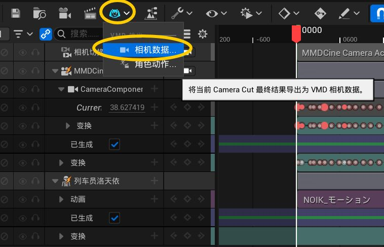
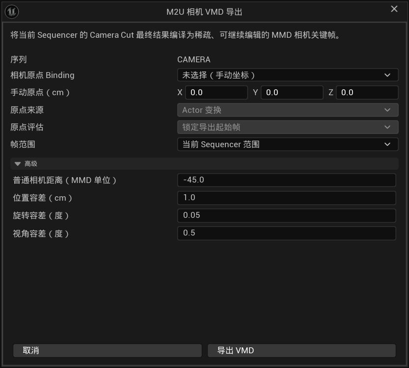

# 10 Exporting a Camera

All previous chapters were about bringing things from MMD into Unreal. This one goes the other way: save your tuned camera work back into a `.vmd` file, take it back to MMD, or share it with friends who still use MMD.

> **Note:** This manual was translated by AI from the Chinese original, which is the authoritative version. Some expressions may not be fully accurate.

## What This Feature Does

In Unreal you can adjust the camera freely: move positions, change pacing, add moves. When you are happy, one click compiles the final result of the whole shot into a `.vmd` camera file that MMD can open directly. In short: **however it plays in Unreal, that is how it will play in MMD.**

## Export Steps

1. In the Content Browser, **double-click** the camera sequence you imported earlier (or created in Unreal). A timeline editing window opens.
2. Look at the toolbar at the top of that window and find the button labeled **M2U** (a small camera icon). If you cannot find it, hover over toolbar icons to read their tooltips.
3. Click it and an export settings window appears.
4. Set the options as explained below.
5. Click **Export VMD**, choose a location and file name (default is `SequenceName_Camera.vmd`).
6. A result report pops up when finished.

## What Each Option Means

A little background first: MMD records cameras as "which reference point, how far from it, turned to which angle", while Unreal cameras are free. So the most important thing during export is telling the plugin **where that reference point is**.

### Camera Origin Binding (who is the reference point)

The dropdown lists everything appearing in this camera sequence:

- **Pick your character** (most common): the export uses the character as reference, so when opened in MMD, the relative relationship between camera and character matches the original.
- **None (Manual Coordinates)**: pick nothing and type X, Y, Z coordinates yourself in the boxes below.

### Origin Source / Component, Bone, Socket

After choosing a reference object, specify which part of it serves as the point:

- **Actor Transform**: use the whole object's position. Simplest, usually enough.
- **Component Transform / Bone or Socket Transform**: make the reference point follow a specific bone of the model. The name box below defaults to `全ての親`, the model's root bone; usually no change needed.

### Origin Evaluation

- **Lock at Export Start**: the reference point freezes where it was on the first frame. Default choice, fine for most cases.
- **Follow Every Frame**: the reference point is re-read every frame, useful when the object itself moves around in the scene.

If the exported result looks misaligned with the scene in MMD, switch to the other option and export again.

### Frame Range

- **Current Range**: export the entire timeline.
- **Custom Range**: export only part of it by entering start and end frames — for instance just the first half of your work.

### Advanced (collapsed by default; leave it alone)

Four precision values: smaller tolerances produce more keys and higher fidelity; larger ones produce leaner files. "Generic Camera Distance" is MMD's standard distance value; keep the default. If you do not understand them, touch nothing.

## Reading the Result Report

The report after a successful export contains several numbers:

| Number | Meaning |
|---|---|
| Dense samples | How many frames were checked |
| Shots | How many position changes were recognized |
| Sparse VMD keys | How many camera key points were written into the file |
| Max position / rotation / view-angle error | Largest deviation from the original picture |

If all three error numbers are tiny, the export succeeded. Occasional warning entries mean minor trade-offs were made somewhere; they usually do not matter.

## Common Problems

### The M2U menu is missing when exporting a camera

Open the Level Sequence you want to export in Sequencer and make sure the timeline contains a **Camera Cut**. If you want to export character motion instead, see [09 Exporting Character Motion VMD](09-export-motion.md).

## Next Step

Both roads are now open: MMD content comes in, and Unreal character motion and cameras can go back. For other problems, see [11 Other Common Problems](11-other-faq.md).
