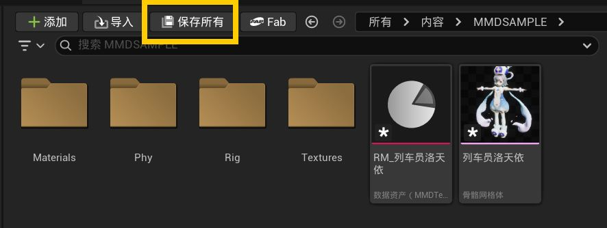
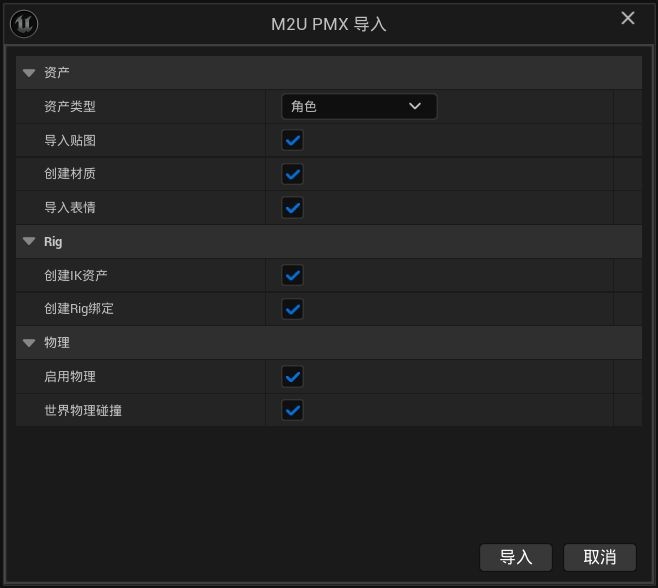

# 02 モデルのインポート

この章では、MMDの `.pmx` モデルをUnrealに持ち込む方法を説明します。インポートが終わると、シーンにドラッグでき、表情も作れ、髪やスカートが自然に揺れるキャラクターが手に入ります。

> **お知らせ**：本マニュアルは中国語の原文（正式版）をもとにAIで翻訳したものです。表現が完全に正確ではない場合があります。

## 始める前：モデルフォルダを確認する

`.pmx` ファイルは単独では動きません。色や服の模様は、その横にあるテクスチャファイルに入っています。次のことを確認してください：

- モデルと専用テクスチャが元のフォルダで一緒になっていること。
- `.pmx` ファイルだけを受け取った場合は、まず配布者に完全なパッケージを求めてください。

## インポート手順

1. Unreal下部の**コンテンツブラウザ**（アセットのサムネイルが並ぶ領域）を探します。最初にこのモデル用の空フォルダを作っておくのがおすすめです。
2. `.pmx` ファイルをコンテンツブラウザに直接ドラッグします。
3. インポート設定ウィンドウが出ます。初回は何も変えず、右下の**インポート**ボタンを押すだけでOKです。
4. 進行状況が終わるのを待ちます。大きなモデルほど時間がかかりますが、正常な現象です。
5. 完了すると、フォルダにはモデル関連の一式が揃っています。
6. 忘れずにこまめに保存してください。手動で保存しないままUnreal Editorを閉じると、インポートしたアセットは消えてしまいます。

## 各オプションの意味

ウィンドウの選択肢をグループごとに説明します：

### アセットタイプ

- **キャラクター（Character）**：人物モデル。ほとんどの場合はこれを選びます。
- **シーン（Scene）**：ステージ・部屋・家具など、自分では動かないモデル。

### テクスチャと見た目

- **テクスチャをインポート（Import Textures）**：モデルが使う色や模様のファイルも一緒に取り込みます。必ずオンのまま。外すと模型が灰色になります。
- **マテリアルを作成（Create Materials）**：Unreal Engineの使用規則に沿った親子マテリアルアセットをモデル用に自動生成します。

### 表情

- **Import Expressions（表情を取り込む）**：瞬き・笑顔・口の開閉などの表情変化が入り、複数の小さな表情を組み合わせた合成表情にも対応します。
- フル体験ならオンのまま。今は体さえあればいいならオフにすると速くなります。

### ポーズ補助ツール

- **IKアセットを作成（Create IK Asset）** と **Rigバインディングを作成（Create Rig Binding）**：ポーズ付けや調整のための補助ファイルを作ります。よく分からなくても**初期値（オン）のままで大丈夫**です。邪魔にはなりません。

### 物理

- **フィジックスを有効化（Enable Physics）**：髪・スカート・アクセサリーがモーションに合わせて自然に揺れます。デフォルトでオンです。
- **ワールド物理コリジョン（World Physics Collision）**：揺れる部分がシーン内の壁や床に押し返されるかどうか。例えばキャラが壁際に立つとき、髪が壁にめり込まず押しのけられます。デフォルトでオンです。

## インポート後に得られるもの

インポート先のフォルダを開くと、次のようなものがあります：

| 見えるもの | 正体 |
|---|---|
| シーンにドラッグできるキャラクター | モデル本体。ダブルクリックで確認できる |
| `Materials` フォルダ | モデルのマテリアル |
| `Textures` フォルダ | モデルのテクスチャ |
| `RM_<MeshName>` ファイル | PMXモデルのコメントを保存するテキストアセット。ダブルクリックで確認できる |
| `IKR_` で始まるファイル | アニメーションデータのリターゲットに使うUnrealアセット |
| `CR_` か `CRMMD_` で始まるファイル | 現代的な手動ポーズ用Rigコントローラー |
| `ABP_Post_` で始まるファイル | MMDのIK・追加変形・物理をリアルタイムに適用するAnimation Blueprint。物理を有効にした場合は第03章に従って調整できます |

マテリアルとテクスチャはそれぞれ `Materials` と `Textures` サブフォルダに整理されています。

`RM_<MeshName>` はPMXモデルのコメントから生成されるテキストアセットで、追加のモデルファイルではありません。PMXに日文・英文コメントがある場合はそれらを保持します。ダブルクリックで内容を確認でき、モデルを再インポートするとテキストも更新されます。

## よくある問題

### モデルをドラッグしても何も起きない

順に確認してください：

1. **Edit > Plugins** でプラグインとKawaiiPhysicsの両方が有効になっているか。インストール後はエディタの再起動も必要です。
2. 圧縮ファイルではなく `.pmx` ファイル本体をドラッグしたか。
3. コンテンツブラウザの別のフォルダでもう一度試す。

1つ目が通らない場合は、[ダウンロードとインストール](01-ダウンロードとインストール.md)を見直してください。

### インポートできたのにモデルが灰色・白色のまま

テクスチャが一緒に入っていません。最も多い原因は、テクスチャが `.pmx` と別の場所にあることです。完全な素材フォルダを元どおりに揃え、灰色のモデルを削除して再インポートし、**Import Textures（テクスチャをインポート）** にチェックがあるか確認してください。

### MMDと見た目がわずかに違う

一部のモデルが使う特殊なフィッティング方式は現在近似表示のため、裾や毛先が少し異なる場合があります。全体の利用には影響しません。

### MMD特有の光沢や輪郭が完全には再現されない

MMDのSphere、Toon、Edgeなどのマテリアル表現は現在、基本マテリアルを中心に処理されます。そのため、一部の光沢や輪郭の見え方がMMDと異なる場合があります。

### 同名競合でインポートが止まる

フォルダに同名アセットが既にあります。既存内容を守るため上書きは拒否されます。モデル名を変えるか、新しいフォルダで再度インポートしてください。

## 次のステップ

モデルが入りました。まず姿勢と物理を確認しましょう：[03 モデルの姿勢と物理調整](03-モデルの姿勢と物理調整.md)。
