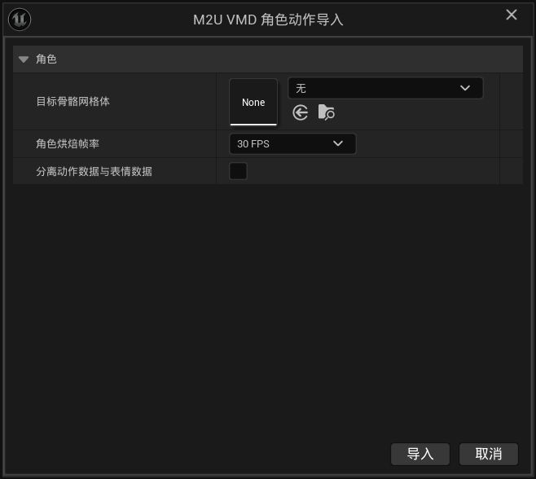

# 05 キャラクターモーションのインポート

この章では、MMDのダンスや演技（`.vmd` ファイル）を、既にインポート済みのモデルに合わせる方法を説明します。

> **お知らせ**：本マニュアルは中国語の原文（正式版）をもとにAIで翻訳したものです。表現が完全に正確ではない場合があります。

## 始める前に

- [モデルのインポートの章](02-モデルのインポート.md)に従って、少なくとも1つの `.pmx` モデルをインポート済みであること。
- 使いたいモーションの `.vmd` ファイルがあること。
- モーションとモデルはできるだけ元の組み合わせで：MMDでそのダンスを踊ったモデルをそのまま使うのが最も正確です。
- インポート前にMMDでモデルを読み込み、モーションを再生して結果を確認することをおすすめします。モデルによっては特定のモーションで不自然に変形するため、先に知っておくとUnreal側のインポート問題と誤認しにくくなります。

## インポート手順

1. モーションの `.vmd` ファイルをコンテンツブラウザにドラッグします。
2. 表示されたウィンドウを以下の説明どおりに設定します。
3. **インポート**を押して完了を待ちます。

## 各オプションの意味

現在はファイル種別を自動判定するため、インポートタイプを選ぶ必要はありません。選択を求めるウィンドウが表示された場合は、VMDファイルが破損している可能性があります。

### ターゲットスケルタルメッシュ（どのキャラに付けるか）

ドロップダウンから、このプラグインで先ほどインポートしたモデルを選びます。この選択は必須です。選ばないとモーションの付け先が分かりません。

### キャラクターのベークレート（30 / 60）

- 30 FPSを選んだ場合でも、別のフレームレートで動画を出力できます。フレーム補間はUnrealが行います。

- **30 FPS**：MMD自体が毎秒30フレームで動いています。MMDで見た動きをそのまま再現するならこちら。
- **60 FPS**：より細かく記録され、ファイルも大きくなります。布シミュレーションにも使う場合はこちらを選ぶと効果がよくなります。

要するに：**忠実さなら30、用途を増やすなら60。** どちらもモーションの速さや長さは変わりません。ただし格闘系のモーションでは、60 FPSにすると動きが柔らかく感じられる場合があります。

### モーションと表情データを分離（初期値オフ）

オンにすると、体の動きと表情が2つのファイルに分かれます：

- 主ファイルにはダンスなど体の動きだけ。
- `_Expression` で終わるもう1つのファイルには瞬きや口形など表情だけ。

分ける利点：後から表情の強さだけを調整できたり、Aダンスの体にBダンスの表情を合わせたりできます。必要なければオフのままでOK。

## 終わったら得られるもの

フォルダにアニメーションシーケンスアセットが増えます。ダブルクリックするとプレビューウィンドウでキャラクターが一連の動きを行うのを見られます。

いくつか補足します：

- 髪の揺れなどの物理エフェクトはこのアニメーションには記録されません。プレビューで髪が動かなくても、シーン内で再生すれば動きます。
- モデルに存在しない部位のデータがモーションに含まれていた場合、その部分は自動的にスキップされ、左下にメッセージで一覧が表示されます。軽いスキップなら鑑賞にはほぼ影響しません。
- アニメーションのプレビューがMMDと一致しない場合は、プレビュー画面右下にある後処理Animation Blueprintのスイッチが有効になっているか確認してください。

## 同名のときは

既存アセットと同名のファイルをドラッグすると、競合ウィンドウが出ます：

- **追加インポート（Incremental Import）**：古い方を残し、新しい方は `Dance_1` のように自動改名で保存します。同じダンスの複数バージョンを残したいときに選びます。
- **インポートを中止（Abandon Import）**：何も変わらず、今回のインポートを取り消します。ドラッグ間違いならこちら。

## よくある問題

### モーションを入れたら体の一部が動かない

このモデルに存在しない部位のデータがモーションに含まれており、自動的にスキップされました。左下のメッセージに詳細が出ます。軽いスキップなら鑑賞にほぼ影響しません。大きく動かない部分がある場合はモーションとモデルが不適合の可能性が高いので、元のモデルを試してください。

### 表情が変わらない

1. モデルのインポート時に **Import Expressions（表情の取り込み）** にチェックがあったか確認します。
2. モーションに表情データが含まれていたか確認します。**モーションと表情データを分離**をオンにしていた場合、表情は `_Expression` で終わるファイル単独に入っています。再生時にそれを重ねてください。

### まだ対応していない表情はあるか

マテリアルの色変化やボーン移動などの特殊表現は未対応です。現在は瞬き・口形などの顔表情が対象です。

## 次のステップ

キャラが踊れるようになりました。次はカメラも持ち込みましょう：[06 カメラのインポート](06-カメラのインポート.md)。
