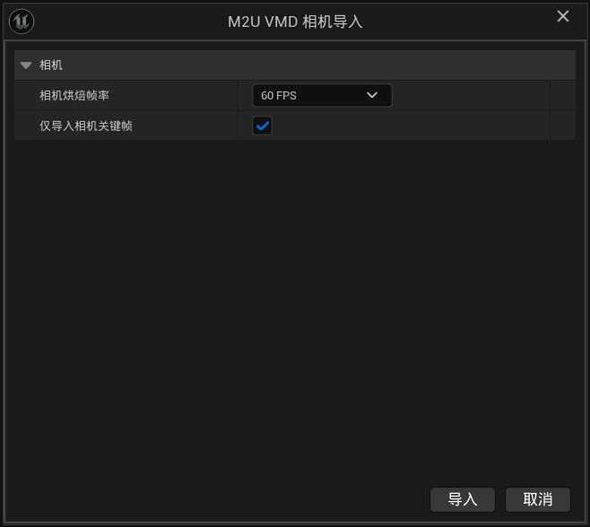

# 06 カメラのインポート

この章では、MMDで調整したカメラワーク（カメラ用 `.vmd` ファイル）をUnrealに持ち込む方法を説明します。インポート後、そのまま再生できるカメラシークエンスが手に入り、位置・移動・ズーム・カット割りはすべてMMDのままです。

> **お知らせ**：本マニュアルは中国語の原文（正式版）をもとにAIで翻訳したものです。表現が完全に正確ではない場合があります。

## 始める前に

- カメラ用の `.vmd` ファイルを用意します。拡張子はモーションと同じですが、中身はレンズデータです。見分けがつかなくても大丈夫。自動判定が助けます。
- できればシーンには既にキャラクターとモーションがあると、再生時に見るものがあります。

## インポート手順

1. カメラ用 `.vmd` ファイルをコンテンツブラウザにドラッグします。
2. 表示されたウィンドウを以下の説明どおりに設定します。
3. **インポート**を押して完了を待ちます。

## 各オプションの意味

### カメラのベークレート（30 / 60）

キャラクターモーションと同じ考え方です：

- **30 FPS**：MMD本来のリズムを忠実に再現します。
- **60 FPS**：`RedialC`が設計した特殊アルゴリズムにより、MMDと同じカット切り替えのジャンプ補間を実現します。

キャラクターモーションは30 FPSでのインポートを推奨しますが、カメラデータは初期状態で60 FPSを推奨します。MMDのカット切り替えは隣接するキーフレームによって実現される一方、多くのソフトウェアは隣接フレームのジャンプ補間に対応していないためです。詳しくは下で説明します。

### カメラキーフレームのみ（初期値オン）

この選択肢はカメラの「作り直しやすさ」を決めます：

- **オン（推奨）**：MMDで打ったキーフレームと、その間の加減速のリズムだけを記録します。後から個々のカメラ位置を微調整しても、元の手応えが崩れません。
- **オフ**：毎秒30（または60）フレーム分の位置をすべて固定します。後からの修正が大変で、通常は必要ありません。

特別な理由がなければ、初期値のオンのままでOKです。

## カット保護

MMD作品には「シュッ」と一瞬でカメラを切り替える瞬間がよくあります。60 FPS選択時、プラグインはこの瞬間切り替えを認識し、そのまま保持します：

- カット前の最終フレームは前のカメラ位置のまま。
- 続く次のフレームで即座に新しい位置へ。
- 間に変な中継画面は一切入りません。

覚えるべきことはひとつ：安心して60 FPSを使ってください。カットは滲みません。

*同じアルゴリズムは以前`RedialC`によってBlenderにも実装されています。Blender版が必要な場合は、[ダウンロードして使用する](https://github.com/JDui/Blender_MMDCameraScale)へ進んでください。*

## 終わったら得られるもの

フォルダにカメラシークエンス（Sequencer）が増えます。ダブルクリックすれば最初から最後までカメラワークを再生できます。シーンの再生フローに組み込めば、視点を自動で引き受け、「カメラマン」として番組全体を撮ってくれます。

シークエンスに含まれるもの：カメラの位置と向き、焦点距離の変化（ズーム）、透視モード、そして全カットのタイミング。

## 同名のときは

モーションと同様、競合ウィンドウが出たら二択です：

- **追加インポート（Incremental Import）**：古い方を残し、新しい方は `Camera_1` のように自動改名で保存。
- **インポートを中止（Abandon Import）**：今回のインポートを取り消し、何も変わらず。

## よくある問題

### カメラカットで変な中継画面が出る

カメラを60 FPSでインポートし、**カメラキーフレームのみ（Camera Keyframes Only）** をオンのままにしたか確認してください。カット保護はこの組み合わせで働きます。

## 流れのおさらい

モデル・モーション・カメラの3点セットが揃いました：

1. `.pmx` をドラッグ → キャラクターができる。
2. モーション `.vmd` をドラッグ → キャラが演じる。
3. カメラ `.vmd` をドラッグ → 誰かがレンズを持ってくれる。

**前にインポートしたモデルを、VMDカメラが作成したSequencerへドラッグし、アニメーションを読み込みます。これで、MMDでモデル・カメラ・モーションを読み込むのと同等の作業がUnrealで完了します。**

あとはUnrealで再生ボタンを押して成果を楽しむだけです。動画を書き出す準備をする場合は、Unreal Movie Renderについて引き続き調べてください。ここから[Epic公式マニュアル](https://dev.epicgames.com/documentation/unreal-engine/movie-render-pipeline-in-unreal-engine)を確認できます。
