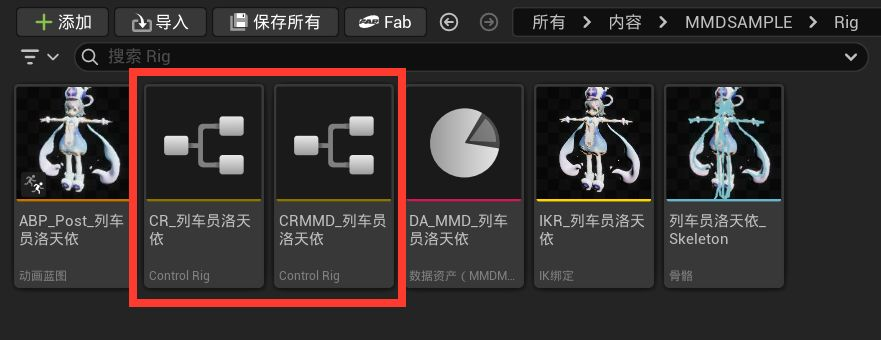
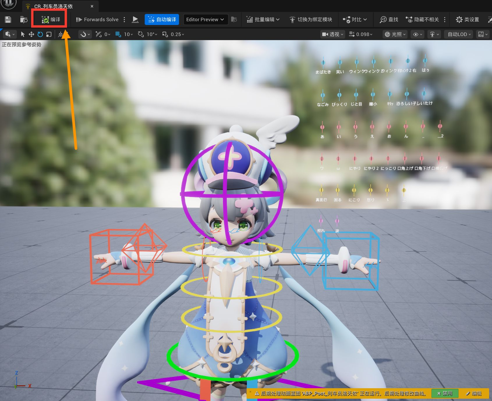
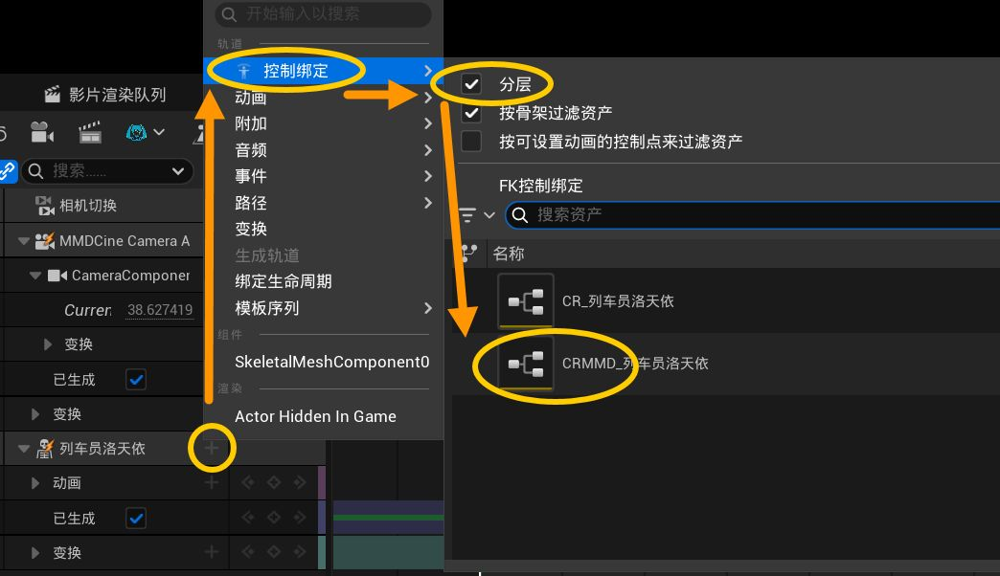

# 08 既存モーションをRigで編集する

この章では、既存のMMDモーションを残したまま、新しい調整をControl Rigの別レイヤーとして重ねる方法を説明します。本プラグインが生成する `CRMMD_モデル名` をSequencerで **Layered Control Rig** として使い、元のモーションの上にコントロールバインディングを追加する方法がおすすめです。

元のAnimation Sequenceをベースとして残し、新しい腕・体・指・表情の変更を上のレイヤーに置きます。そのため、元のキーをベークしたり書き換えたりせず、上のコントロールだけを何度でも調整できます。

## この章を使う場面

- VMDモーションをインポートし、Animation Sequenceを作成済みである。
- 腕を上げる、足のめり込みを直す、目線を変える、表情を調整するなど、一部のポーズだけを修正したい。
- 元のダンスのタイミングと大部分の動きを残し、指定したフレームだけに小さな修正を追加したい。

空のタイムラインから作る場合は、[07 Rigでモーションを作成する](07-Rigでモーションを作成.md)を読んでください。

## 始める前に

- [キャラクターモーションのインポート](05-キャラクターモーションのインポート.md)に従ってVMDをインポートし、対応するSkeletal Meshを選択済みであること。
- MMDキャラクターをレベルとSequencerに追加したLevel Sequenceがあること。
- このモデル用の `CRMMD_モデル名` Control Rigがコンテンツブラウザにあること。モデルのインポート時に **Rigバインディングを作成（Create Rig Binding）** をオンにしておく必要があります。
- Unrealのプラグインセキュリティポリシーにより、モデルのRigを初めて使う前に一度コンパイルが必要になる場合があります。Rigフォルダにある2つのCRアセットを開き、**Compile**をクリックしてから閉じてください。

## 1. 既存モーションをベースに置く

1. Level Sequenceを開くか新しく作成し、World OutlinerからMMDキャラクターをSequencerへ追加します。
2. キャラクターの **Skeletal Mesh** トラックに **Animation** トラックを追加します。コンテンツブラウザからインポート済みのAnimation SequenceをSkeletal Meshトラックへドラッグしても構いません。
3. Animationセクションで使うモーションを選び、開始フレームと終了フレームを設定します。一度再生し、元の足・手・表情が正しく動くことを確認します。
4. このAnimationトラックがベースになります。後から追加するControl Rig修正は**同じキャラクターバインディング**の下に置き、別のキャラクターやカメラのバインディングには置かないでください。

## 2. `CRMMD_` をLayered Control Rigとして追加する

追加時に分層モードを選ぶ方法が推奨です：

1. 同じキャラクターの **Skeletal Mesh** トラックを選び、**+ Track** をクリックします。
2. **Control Rig > Layered** を選び、このモデル用の `CRMMD_モデル名` を指定します。先にRigを選ぶメニューで分層オプションが表示された場合は、**Layered** をオンにして確定します。

3. 追加メニューに **Layered** が表示されない場合は、まず **Control Rig > Control Rig Classes** から `CRMMD_モデル名` を追加します。その後、Sequencer左側のOutlinerでControl Rigトラックを右クリックし、**Convert To Layered** を選びます。
4. Control RigセクションがAnimationセクションと重なっていることを確認します。Control Rigセクションを修正したい範囲だけにすると、その範囲の外では元のAnimation Sequenceがそのまま再生されます。
5. Control Rigトラックを展開し、`CRMMD_` のコントロールが一覧にあることを確認します。生成された `CRMMD_` には現在のボーンモーションを読み取るためのBackwards Solveが含まれているため、既存のAnimation Sequenceを入力として残したまま修正を追加できます。

> **分層できたかの確認方法**：既存モーション上で再生ヘッドを動かしたとき、キャラクターが元のダンス姿勢を保っていれば成功です。`CRMMD_` のコントロールを動かすと、そのフレームに修正だけが加わります。Rigを追加した瞬間に参照ポーズへ戻る場合は、Layeredへ変換していないか、Control RigセクションがAnimationセクションと重なっていない可能性があります。

## 3. 元のモーションに修正を追加する

### 1. 体と手足を修正する

1. 修正したいフレームへ再生ヘッドを移動し、まずベースのポーズを確認します。
2. 必要な `CRMMD_` コントロールを選びます。体では `CTRL_Chest`、`CTRL_UpperChest`、`CTRL_Pelvis`、`CTRL_Neck`、`CTRL_Head` がよく使われます。
3. 腕には `CTRL_UpperArm_L/R`、`CTRL_LowerArm_L/R`、`CTRL_Hand_L/R` を使います。上腕、前腕、手の順に少しずつ回してください。全身のモーションを作り直さず、必要なボーンだけを修正できます。
4. ポーズがよくなったら、変更したコントロールだけを選び、`S` を押すかキーアイコンをクリックします。すべてのコントロールを一度にキーにしないでください。
5. 次の修正フレームへ移動して同じ作業を繰り返します。キーの間はSequencerが自動補間します。修正を保持する場合は、保持区間の開始と終了で同じ修正をキーにします。

### 2. 足・指・目線を修正する

- 足が床にめり込む場合は、`CTRL_LegIK_L/R` または対応する脚・足のコントロールを少し動かします。つま先の向きだけを直す場合は `CTRL_Toe_L/R` を使います。
- 手の形が崩れている場合は、必要な `CTRL_Thumb_*`、`CTRL_Index_*` などの指コントロールだけをキーにします。腕全体に不要なキーを大量に作る必要はありません。
- 目線がずれている場合は `CTRL_Eye_L` と `CTRL_Eye_R` を使い、顔コントロールのチャンネルにキーを打ちます。

### 3. 表情を追加する

1. `CTRL_Face_` グループを展開し、目・口・眉などの顔スライダーを探します。
2. 変更したいフレームでスライダーを調整し、チャンネル横のキーアイコンをクリックして値を記録します。表情は通常0から1の範囲で操作します。
3. 表情を弱くしたい場合は、前後のフレームで小さい値にします。元の表情へ戻したい場合は、上のレイヤーの修正値を小さくし、修正区間の終わりに向けて0へ戻します。

## 4. 分層トラックを管理する

### トラックの順序（Order）

- `CRMMD_` のLayeredトラックが1本だけなら、通常は初期設定のままで構いません。
- Control Rigトラックを複数使う場合は、トラックを右クリックして **Order** を調整します。エディターは100から始まります。複数レイヤーには異なる値を使い、再生してどの修正が最終結果になるかを確認してください。
- 後から追加した通常の非Layered Control Rigが前の修正を上書きする場合は、そのトラックをLayeredへ変換するか、Orderを見直します。ベースのAnimationセクションは変更せず、修正はできるだけLayeredトラックに置きます。

### 修正の強さ（Weight）

- Control Rigトラックを右クリックして **Weight** を有効にすると、レイヤー全体の強さを調整できます。
- Weightが0なら、そのレイヤーを一時的に無効にした状態です。Weightを徐々に上げるキーを作れば、修正を滑らかに出せます。
- WeightのキーもLevel Sequenceに保存されます。試した修正を一時的に無効にするだけなら、トラック全体を削除せずWeightを0にします。

### モーションの一部だけを編集する

Control Rigセクションを修正が必要なフレームだけに短くします。その範囲の外では元のAnimation Sequenceが再生されます。サビの一動作、足を着く瞬間、一部分の表情だけを直すときに便利です。

## 5. カーブと取り消し

1. `CRMMD_` トラックを展開し、移動・回転・表情チャンネルを選び、Curve Editorで補間と接線を調整します。
2. 修正が強すぎる場合は、直前のコントロール操作をUndoするか、現在の範囲のそのコントロールのキーを削除します。ベースのAnimationセクションは削除しないでください。
3. 元の動きと修正後を比較するには、Layered Control Rigセクションを一時的に無効にするか、Weightを0にします。確認後に再び有効にします。
4. 最終結果を再利用可能な新しいアニメーションアセットに固めたい場合は、キャラクターのSkeletal Meshトラックで **Bake Animation Sequence** を使います。VMDを書き出すだけならベークは不要で、現在のSequencerから直接書き出せます。

## 6. プレビュー・保存・書き出し

1. 修正区間の前から再生し、元のタイミングが変わっていないこと、修正が意図したフレームだけで有効になることを確認します。
2. 腕の急な反転、足の床へのめり込み、表情の急変、修正区間の始まりと終わりの不自然な跳ねを確認します。
3. Level Sequenceを保存します。ベースのAnimation Sequenceと上の `CRMMD_` コントロールキーは、Sequencerで一緒に評価されます。
4. 合成したキャラクターモーションをMMDへ持ち帰るには、[09 キャラクターモーション VMD の書き出し](09-キャラクターモーションの書き出し.md)へ進みます。ソースに現在のSequencerを選ぶと、ベースモーションとLayered Control Rigを評価した後の最終ポーズと表情が読み取られます。

このモデルコントローラーの自動バインディングアルゴリズムは、`RedialC`が多大な努力を注いで作り上げたものです。このRigでモーションデータを作成し、便利だと感じた場合は、ツール名をクレジットして、より多くの人に現代的なMMDモーションのキー打ち方法を知ってもらえるようにしてください。

## よくある問題

### `CRMMD_` を追加したら元のモーションが消えた

Control Rigトラックが **Control Rig > Layered** から追加されたか、**Convert To Layered** で変換されたかを確認します。Control RigセクションがAnimationセクションと重なっているか、通常の非Layeredトラックを誤って追加していないかも確認してください。

### 分層後、コントロールがキャラクターと合わない

現在のSkeletal Meshに対応する `CRMMD_モデル名` を使っていること、再生ヘッドがAnimationとControl Rigの共通範囲にあることを確認します。追加後、既存モーションの中間フレームへ移動して、コントロールがキャラクターに追従するか確認してください。

### 腕だけ直したいのに全身が上書きされた

不要なコントロールキーを削除し、上腕・前腕・手の修正だけを残します。Root、Center、Pelvisなど全体を動かすコントロールに関係のないキーを追加しないでください。分層編集では、上のレイヤーには変更が必要な部分だけを記録します。

## 次のステップ

修正が終わったら、[09 キャラクターモーション VMD の書き出し](09-キャラクターモーションの書き出し.md)で現在のSequencerのモーションと表情をVMDとして書き出せます。カメラの書き出しは、その後の[10 カメラの書き出し](10-カメラの書き出し.md)を参照してください。
