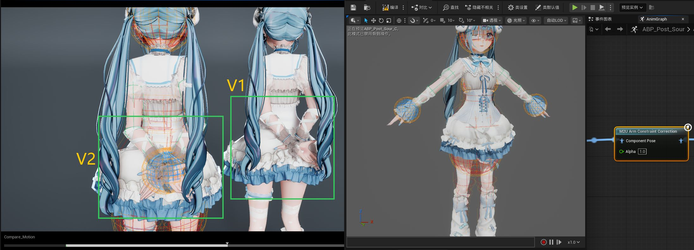
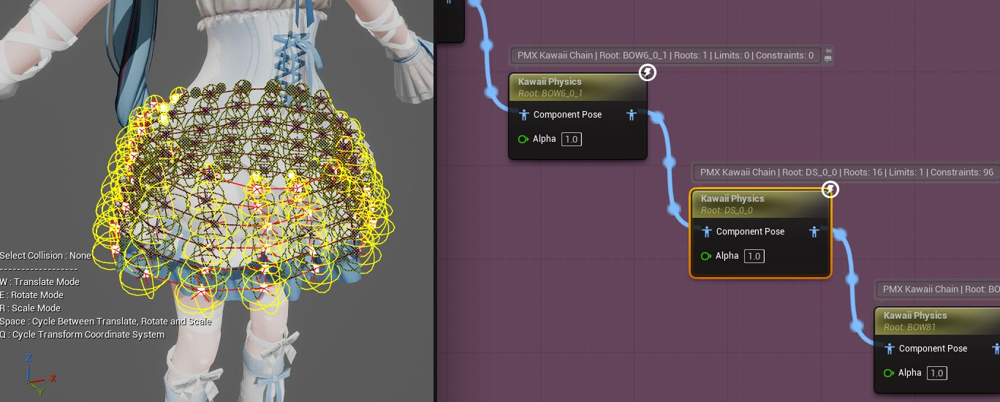
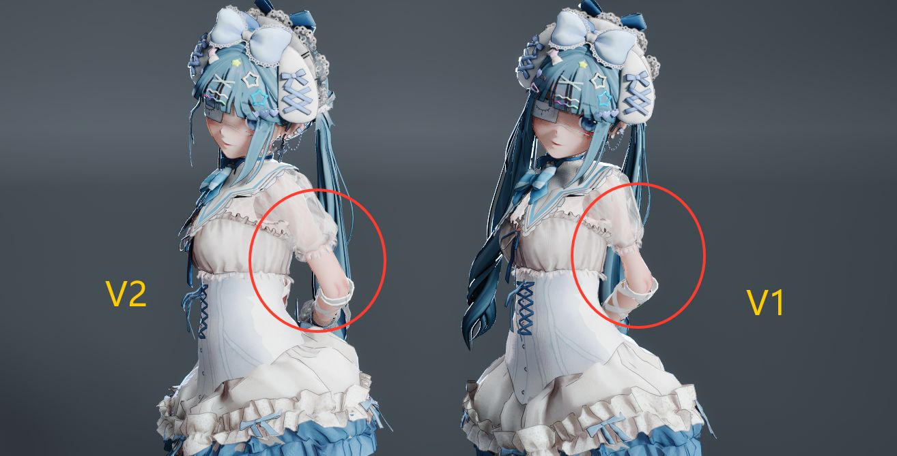
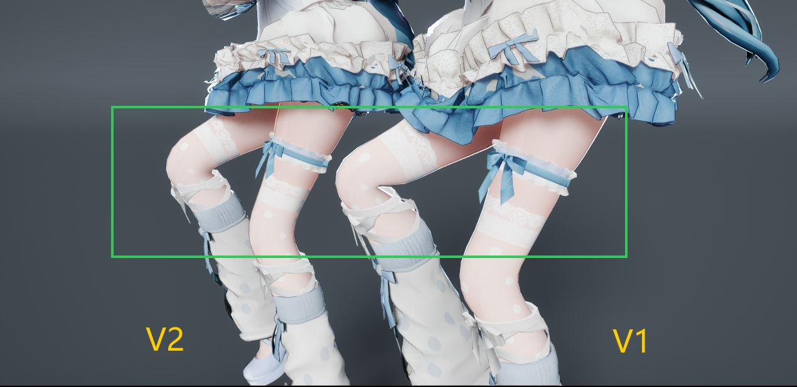
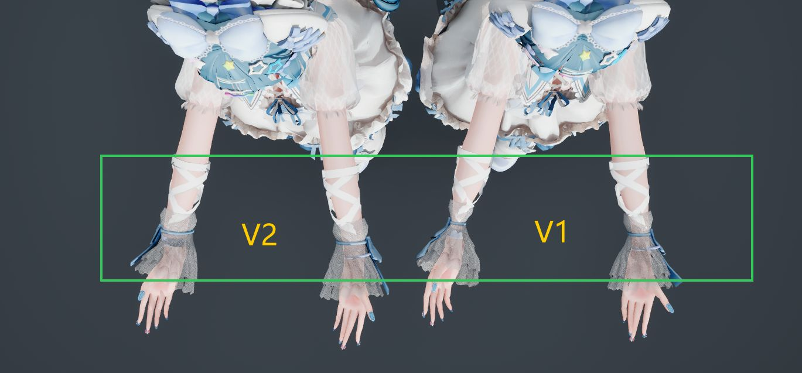
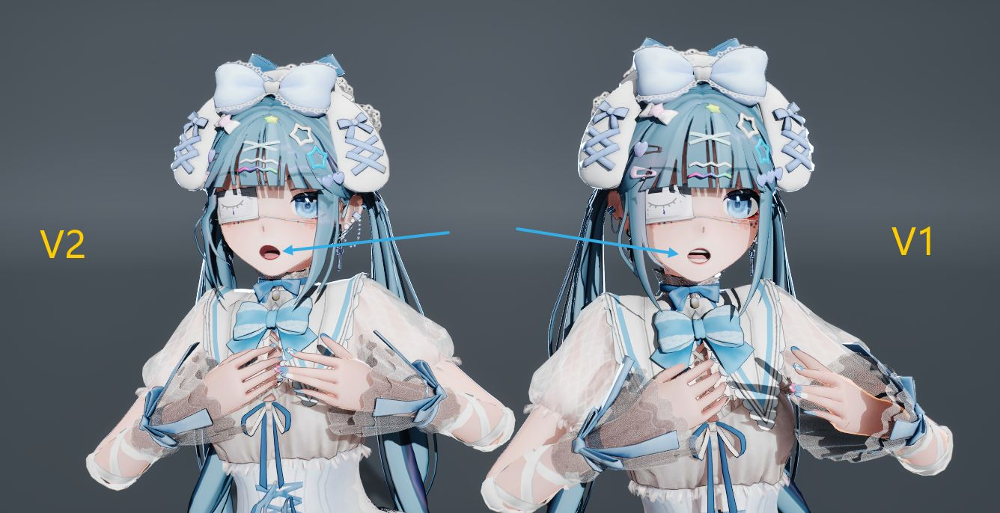

# MMD2Unreal

[简体中文](README.md) · [English](README_EN.md) · [日本語](README_JA.md)

## プロジェクト概要

**MMD2Unreal** は、**Unreal Engine 5.8** 向けのMikuMikuDance互換プラグインです。

Blenderなどの中間ソフトを経由せずに、MMDユーザーが **PMXモデル、VMDキャラクターモーション、VMDカメラ** をUnreal Engineへ直接持ち込み、Unrealで作成した内容をMMDコミュニティへ書き戻せるようにします。

## V2 機能スクリーンショット

| 内容 | スクリーンショットと説明 |
| --- | --- |
| 腕の拘束補正 |  Post Process AnimBP 内の `M2U Arm Constraint Correction` が身体、頭部、脚、反対側の腕の回避を処理します。 |
| スカート物理 |  PMX の剛体、Joint、利用可能な横方向のチェーン間制約を KawaiiPhysics 設定へ変換します。 |
| SDEF の肩 |  V2（左）は曲げた肩でのネイティブ SDEF 姿勢補正を示します。 |
| SDEF の脚 |  V2（左）は曲げた脚周辺での改善を示します。 |
| SDEF の手 |  V2（左）は手首と手の周辺の結果を示します。 |
| 複雑な混合表情 |  V2（左）は複雑な混合表情に対応し、一部の特殊表情も MMD により近い組み合わせ結果になります。 |

## V2 更新概要

V2 では、合計 **376 件のバグ修正、機能改善、パフォーマンス最適化** を実施しました。以下は利用者にとって重要な更新です。

**インポート・モデル・アセット**

1. PMX 2.0 / 2.1 モデルを完全にインポート。
2. UE ネイティブの Skeletal Mesh と Skeleton を生成。
3. 日本語ボーン名と MMD ルートボーンの意味を保持。
4. テクスチャをインポートし、基本 Material / Material Instance を生成。
5. インポート直後のマテリアル差し替えで表情が消える問題を修正。
6. モデルコメントを読み取り可能な `RM_<MeshName>` テキストアセットとして生成。
7. 標準人体モデル向けの IK Rig を自動準備。
8. `ABP_Post_<MeshName>` を自動生成してバインド。
9. 再インポート時に自動生成グラフの重複ノードを修復。
10. 生成されるモデル、アニメーション、Rig は UE ネイティブアセットとして保持。

**SDEF・QDEF・表情**

11. SDEF は UE ネイティブスキニングと姿勢補正データを使用。
12. SDEF の姿勢補正はインポート時の LOD0 を対象。
13. 曲げた肩周辺の SDEF 表現を改善。
14. 曲げた脚周辺の SDEF 表現を改善。
15. 手首と手の周辺の SDEF 表現を改善。
16. QDEF は4ボーンウェイトを保持し、BDEF4 リニアスキニングとして近似。
17. SDEF と QDEF が混在するモデルをインポート可能。
18. リアルタイムプレビューの互換性を改善するため、開発期 PMXD アセット生成経路を削除。
19. Vertex Morph から UE Morph Target を生成。
20. Group / Flip Morph は参照する Vertex Morph を再帰的に展開。
21. 複雑な混合表情と一部の特殊表情の組み合わせ結果を MMD に近づけた。
22. ボーン表情と入れ子グループを Skeleton カーブと後処理 Blueprint で評価可能。

**Control Rig・IK Rig・双方向 RTG**

23. `CR_` Hand IK Control Rig を自動生成。
24. `CRMMD_` 三段アーム FK Control Rig を自動生成。
25. 両方の Control Rig が、インポート可能なすべての Vertex Morph の表情コントローラーを作成。
26. 表情コントローラーを眉、目、口、その他、未分類パネルへ整理。
27. Control Rig は初回使用前のウォームアップが不要になり、生成直後から利用可能。
28. Manny → MMD 用 `RTG_<MeshName>` を自動生成。
29. MMD → Manny 用 `RTG_<MeshName>_ToManny` を自動生成。
30. 双方向の RTG はそれぞれ Source / Target IK Rig と Operation Stack を設定。
31. 双方向 RTG に基本の口形・まばたき Curve Remap を追加。
32. RTG は MMD の身体ルート、Root Motion、足 IK のワークフローを維持。

**モーション・物理・姿勢修正**

33. VMD ボーンモーションを MMD Bezier 補間でインポート。
34. VMD Morph / 表情カーブをキャラクターモーションとともにインポート。
35. 30 FPS / 60 FPS のキャラクターモーションを生成可能。
36. PMX Grant、CCD IK、IK Link Limit を Post Process AnimBP で評価。
37. `M2U Arm Constraint Correction` ノードを追加。
38. 腕の拘束補正で胴体、頭部、脚、反対側の腕への入り込みを抑制。
39. 腕が交差する場合は優先度とソフトゾーンで急な押し戻しを抑制。
40. PMX の剛体、Joint、動的ボーンを KawaiiPhysics ワークフローへ変換。
41. 利用可能なスカートの横方向 Joint をチェーン間制約へ変換。
42. 髪として識別された動的チェーンは通常の角度制限を自動で解除。

**Reimport・信頼性・性能**

43. PMX モデル Reimport システムを追加。
44. Reimport でコアの Mesh / Skeleton アセットを上書きするか選択可能。
45. Material と Texture を個別に上書き可能。
46. PhysicsAsset を個別に上書き可能。
47. Post Process AnimBP を個別に上書き可能。
48. IK Rig / RTG と Control Rig を個別に上書き可能。
49. 上書きを選択しなかった既存の付随アセットは、プラグインによる再生成や削除から保護。
50. Reimport は更新作業を改善しますが、作者 RedialC は可能な限り UE 内の上書きインポートを避けることを引き続き推奨します。重要な手作業の変更は先にバックアップするか、別アセットとして保存してください。
51. そのほかにも、インポート安定性、アセット生成、アニメーション評価、互換性、性能に関する多数の改善があります。

## 特徴的な機能

MMD2Unrealは単なるPMX / VMDコンバーターではなく、MMDキャラクターをUnreal内で実際に使うために必要なアニメーション、Rig、物理、往復ワークフローまでまとめて準備することを目指しています。

- **Rigワークフローを自動生成**：PMXインポート時にIK Rig、Manny ↔ MMDの双方向IK Retargeter、`CR_` / `CRMMD_` Control Rigを自動生成し、Sequencerでのポーズ調整、リターゲット、モーション編集にそのまま使えます。
- **VMDデータの双方向互換**：MMDからキャラクターモーション、表情、カメラをUnrealへ取り込み、UnrealのAnimation Sequence / Sequencerの結果を再びVMDとして書き出せます。
- **MMD ↔ ARKitの基本表情変換**：生成される双方向RTGには、MMDの `あ / い / う / え / お / まばたき` と一般的なARKitの口形・まばたきカーブの簡易双方向マッピングが含まれます。
- **腕の拘束補正**：上腕、前腕、手が胴体、首、頭部、反対側の腕へ入り込むのを自動で抑えます。Debug Drawと調整可能な回避パラメータを備え、手首軸、肘軸、捩り、補助ボーンを持つモデルでもPMX本来の依存関係を維持します。
- **PMX IK / Grant / 補助ボーンをリアルタイム評価**：CCD IK、追加回転 / 追加移動、IK Link Limitを単純にベークして失うのではなく、自動生成されるPost Process AnimBP内で継続して評価します。
- **KawaiiPhysics物理ワークフローを自動生成**：PMXの剛体、Joint、動的ボーン情報からPhysicsAsset、コリジョングループ、KawaiiPhysicsノードを準備します。スカートのような複数チェーン構造では、利用可能な横方向Jointもチェーン間の制約へ変換し、隣り合うパネルが布構造を保てるようにします。
- **SDEF・MorphとQDEFの近似対応**：SDEFはネイティブ姿勢補正を使用し、Vertex / Group / Flip Morphの関係を保持します。QDEFは現在BDEF4リニアスキニングへ変換するため、変形に差が生じます。
- **選択式Reimport**：PMX更新時に、メッシュ、マテリアル、PhysicsAsset、Post Process AnimBP、IKR / RTG、Control Rigなどを個別に再生成するか選べます。
- **Unrealネイティブな作業感**：Skeletal Mesh、Animation Sequence、Level Sequence、Control Rig、IK Rig、IK Retargeter、Animation BlueprintなどのUE標準アセットを生成し、別の専用ランタイムウィンドウを維持する必要がありません。

## 目標と機能

> ✅ 実装済み　　🟡 基本実装あり

### PMXモデル

- ✅ PMX 2.0 / 2.1モデルをインポート。
- ✅ モデル、頂点、面、テクスチャ、マテリアル、ボーン、Morph、表示枠、剛体、Jointなど主要なPMXデータを読み込み。
- ✅ Unreal EngineネイティブのSkeletal MeshとSkeletonを生成。
- ✅ MMDの日本語ボーン名を保持し、固有のルートボーン `全ての親` を生成。
- ✅ BDEF1 / BDEF2 / BDEF4ボーンウェイトに対応。
- ✅ メインテクスチャをインポートし、基本Material / Material Instanceを生成。
- ✅ Vertex MorphをUnreal Morph Targetへ変換。Group / Flip Morphから参照されるVertex Morphも再帰的に展開し、合成ウェイトを保持。
- ✅ PMXインポート後に `IKR_<MeshName>` IK Rigを自動生成し、Full Body IKソルバースタックと手・足・つま先のGoalを設定します。さらにプラグイン内蔵の最小構成のUE5 Mannyアセットを使用して、Manny → MMD用の `RTG_<MeshName>` とMMD → Manny用の `RTG_<MeshName>_ToManny` を直接生成します。
- ✅ `ABP_Post_<MeshName>` ポストプロセスAnimation Blueprintを自動生成してバインド。
- ✅ PMXインポート後に `ABP_Post_<MeshName>` を生成・バインドし、IK、Grant、物理をリアルタイムで処理。再インポート時はグラフを修復して重複ノードを維持しません。
- ✅ SDEFはUEネイティブスキニング、生成Corrective Morph、最終姿勢ドライバを使用します。QDEFは4ボーンのウェイトを使うBDEF4リニアスキニングへ変換します。SDEF+QDEF混在モデルもインポートでき、PMXDアセットは生成されません。
- ✅ ボーンモーフと入れ子のグループを Skeleton のカーブと後処理 AnimBP で適用します。
- ✅ 両Control RigはPMXの眉・目・口・その他・未分類パネルごとにVertex Morphの表情スライダーを生成します。その他の表情タイプはランタイム表情システムに保持されます。
- ✅ 2方向のRTGはSource/Target IK Rig、PelvisとRoot Motion、チェーン対応、Target IKをそれぞれ独立して設定し、逆方向アセットではPMXをTargetにした場合だけ必要な操作を流用しません。
- ✅ 両方向のRTGには基本的な表情Curve Remapも設定され、MMDの `あ / い / う / え / お / まばたき` と一般的なARKitの口形・まばたきカーブをおおまかに双方向変換できます。

### VMDキャラクターモーション

- ✅ VMDボーンモーションをインポート。
- ✅ VMD Morph / 表情カーブをインポート。
- ✅ CP932 / 日本語名に対応。
- ✅ 30 FPSと60 FPSのモーション生成に対応。
- ✅ キーフレームの単純なコピーではなく、MMD Bezier補間でモーションを評価。
- ✅ 元のボーントラックをフレームごとにサンプリングし、ボーンごとの独立トラック、基準ポーズのローカル移動、Bezier補間、クォータニオンの連続性を保持。
- ✅ PMX Append Translation / Rotation（Grant）、CCD IK、IK Link LimitをAnimation Sequenceへベークせず、ポストプロセスAnimation Blueprintでリアルタイム評価。
- ✅ `全ての親` / `センター` / `グルーブ` および `root` / `center` / `groove` の移動をそれぞれ保持し、トラックを統合しません。
- ✅ キャラクターモーションと表情を、メインモーションと独立した `_Expression` アニメーションに分離可能。
- ✅ Unreal Animation Sequenceまたは現在のSequencerからキャラクターモーションVMDを書き出し。

### VMDカメラ

- ✅ VMDカメラデータをインポート。
- ✅ Unreal Level SequenceとCine Cameraを自動生成。
- ✅ カメラ位置、回転、画角 / 焦点距離、透視 / 正投影モード、Camera Cutを生成。
- ✅ 30 FPSと60 FPSのカメラシーケンスに対応。
- ✅ MMDカメラのBezier補間セマンティクスを保持。
- ✅ 60 FPSでMMDの隣接する元フレームのカットを保護し、ハードカット間に誤った中間フレームを生成しません。
- ✅ VMD正投影カメラに対応し、Ortho Widthを生成。
- ✅ 現在のSequencer Camera Cutの最終評価結果からVMDを書き出し。

### Unrealワークフロー

- ✅ PMX、キャラクターVMD、カメラVMDをContent Browserから直接インポート。
- ✅ 生成されるモデル、アニメーション、カメラはUnrealネイティブアセットで、通常のUE制作フローを続けて利用可能。
- ✅ 生成アセットに必要なMMD元データを保持。
- ✅ 同じPMXを再インポートすると、ポストプロセスAnimBPのIK / 物理グラフを再構築し、重複ノードを削除。
- ✅ Sequencer上部の `M2U > Export Camera VMD...` から、現在開いているLevel Sequenceを標準Camera VMDとして書き出し。
- 🟡 非標準スケルトンや特殊なチェーン構造では、キャラクターごとにIK Retargeterの調整が必要な場合があります。

## ドキュメント

- **[日本語ユーザーマニュアル](Docs/UserManual/日本語/README.md)** — インストール、モデル・モーション・カメラのインポート、Control Rigによるモーション作成と編集、VMD書き出しを順番に説明します。
- [中文用户手册](Docs/UserManual/README.md)
- [English User Manual](Docs/UserManual/English/README.md)

## 既知の制限

- SDEF姿勢補正は現在インポートLOD0のみを対象とし、後から生成した簡略化LODには対応する補正データがありません。QDEFは現在BDEF4リニアスキニングへ変換され、双対クォータニオン変形は再現されないため、ねじりや曲げでMMDより収縮・扁平化する場合があります。開発中にはPMXD Mesh Deformer方式が存在しましたが、リアルタイムプレビューの性能と多数の互換性問題を考慮し、現在は一時的に削除しています。[開発・検証ノート](Docs/DEVELOPMENT_AND_TESTING.md)を参照してください。
- Vertex Morph、および再帰的にVertex Morphへ展開できるGroup / Flip MorphはUnreal Morph Targetを生成します。Bone / UV / Material / Impulse Morphは対応するUE機能へまだ変換されません。
- 特殊なボーン、複雑なIK、非標準構造を持つモデルでは、互換性対応や結果の調整が必要になる場合があります。

## 謝辞

MMDデータ形式とUnrealでの実装に関する多くの細部は、次のオープンソースプロジェクトの公開成果から学びました：

- **[MMD Tools](https://github.com/MMD-Blender/blender_mmd_tools)**
- **[OpenMMD](https://github.com/dskjal/OpenMMD)**
- **[VRM4U](https://github.com/ruyo/VRM4U)**
- **[AMAP5](https://github.com/hatoghx/AMAP5)**

MMD2Unrealは独立して実装されたプロジェクトであり、上記プロジェクトの移植、Fork、複製ではありません。
